# Multi-Agent System Architecture

A practical guide to choosing, drawing, and defending the structure of a multi-agent system. This document is opinionated. The bias is toward systems that survive contact with real traffic, real failures, and on-call rotations.

---

## 1. Why Architecture Matters Before Prompting

Most multi-agent systems fail not because the prompts were bad, but because the topology was wrong. The wrong topology produces:

- **Runaway token costs.** A flat swarm chatters until the context window collapses.
- **Untraceable failures.** A peer-to-peer mesh with no log gives you nothing to debug.
- **Brittle handoffs.** Sequential pipelines without retry semantics drop work silently.
- **State drift.** Two agents independently mutating shared state without locking.

The architecture pins down four things before any prompt is written:

1. **Who decides what happens next.** (Control flow)
2. **Who knows what.** (State sharing)
3. **What happens when something breaks.** (Failure handling)
4. **How you'll see it from the outside.** (Observability)

If your design document does not answer these four questions, you do not have an architecture yet — you have a wish list.

---

## 2. The Four Canonical Topologies

There are many ways to draw this, but in practice you will pick one of four. Hybrids exist but are usually built by composing these.

### 2.1 Single-Agent (Monolithic Loop)

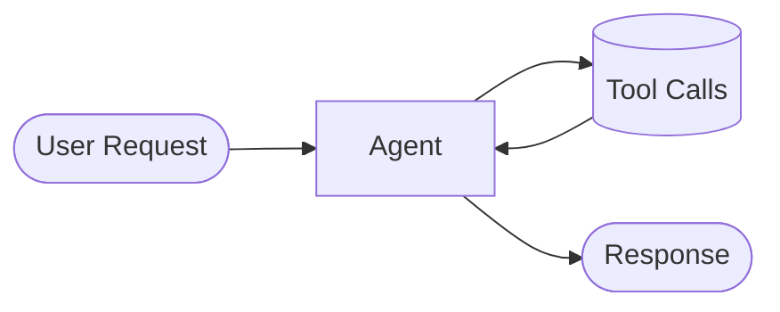

One LLM call, possibly looping with tools. No sub-agents. This is the baseline.

**Use when:**
- The task fits comfortably in one context window.
- Tool count is manageable (under ~30) so tool-selection accuracy stays high.
- You don't need parallelism.

**Avoid when:**
- The job has clearly separable phases (research, draft, review).
- You need different system prompts or different model sizes for different sub-tasks.
- Context bloat is already a problem.

**Real failure mode:** "Lost in the middle." As tool history grows, the model forgets early instructions. You see it as inconsistent behavior after ~30 turns.

### 2.2 Hierarchical (Orchestrator + Workers)

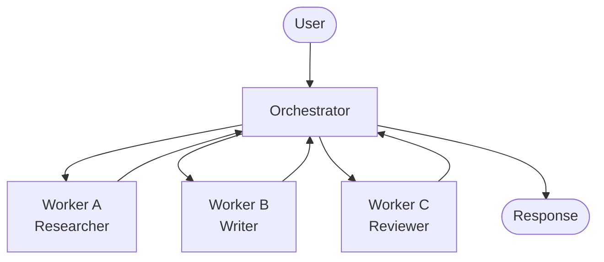

A coordinator agent plans, delegates to specialist sub-agents, and aggregates their outputs. Each worker runs in its own context. This is the dominant pattern in production systems today (Claude Code's Task tool, LangGraph supervisor, CrewAI's hierarchical process, AutoGen GroupChat with a manager).

**Use when:**
- Tasks decompose cleanly into specialist roles.
- You want context isolation — workers shouldn't see each other's noise.
- You want to mix model sizes (cheap workers, expensive orchestrator).

**Avoid when:**
- The orchestrator becomes a bottleneck because every message goes through it.
- Workers need to negotiate with each other (debate, market-style bidding).

**Real failure mode:** Orchestrator over-summarization. The supervisor compresses worker output into a one-line summary, and downstream workers lose critical detail. Mitigation: pass through full worker artifacts via a shared store keyed by task ID, not just a summary string.

### 2.3 Flat Team (Peer-to-Peer)

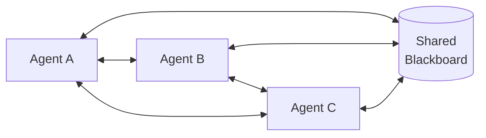

A small set of named agents communicate directly, often via a shared blackboard. Examples: AutoGen GroupChat with a round-robin or auto-selected speaker, MetaGPT's role-based team.

**Use when:**
- The task is naturally collaborative (writer + editor + fact-checker).
- You want agents to challenge each other's outputs.
- The team size is small and stable (3–7 agents).

**Avoid when:**
- Team size grows past ~8 — coordination overhead explodes.
- You need deterministic ordering or audit trails — peer-to-peer is by nature non-deterministic.

**Real failure mode:** Conversation loops. A and B keep refining each other's output indefinitely. Mitigation: explicit termination conditions (max rounds, "approved" signal, cost ceiling).

### 2.4 Swarm

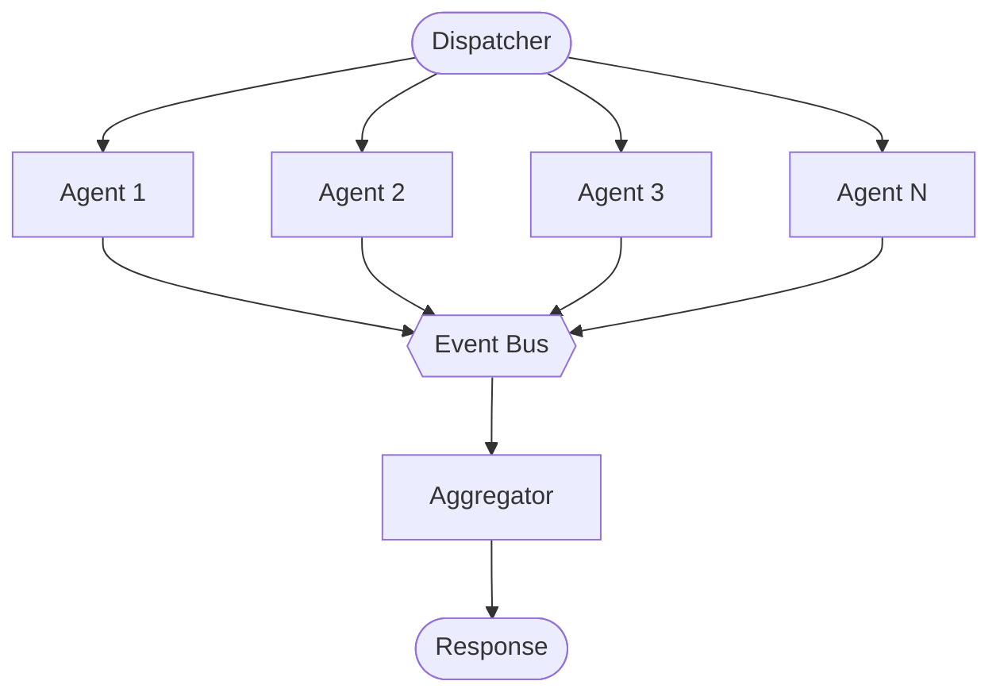

Many parallel agents, often homogeneous, processing items independently. Coordination is loose; results are aggregated downstream. Think map-reduce with LLM workers, or document-processing fan-out (one agent per page).

**Use when:**
- The work is embarrassingly parallel (per-document classification, per-record enrichment).
- You can tolerate stragglers and partial results.

**Avoid when:**
- Items have cross-dependencies (one document references another).
- You need ordered output without an extra aggregation step.

**Real failure mode:** Rate-limit thrash. 200 agents simultaneously hit the same upstream API and trip the limiter. Mitigation: a token-bucket gateway in front of shared resources, plus exponential backoff in workers.

---

## 3. The Orchestrator Pattern in Detail

The orchestrator deserves its own section because it is the most common pattern and the easiest to build badly.

### 3.1 What an Orchestrator Owns

An orchestrator agent has four jobs and only four:

1. **Plan.** Decompose the user's request into typed tasks.
2. **Dispatch.** Hand each task to the right worker with the right inputs.
3. **Aggregate.** Combine worker outputs into a coherent result.
4. **Recover.** Decide what to do when a worker fails, times out, or returns garbage.

It does **not** do the work itself. The moment an orchestrator starts writing code or doing analysis directly, you've lost the benefit of specialization.

### 3.2 Orchestrator Skeleton

Framework-agnostic pseudo-code:

```python
class Orchestrator:
    def __init__(self, workers: dict[str, Worker], state: StateStore, bus: EventBus):
        self.workers = workers
        self.state = state
        self.bus = bus

    def run(self, request: UserRequest) -> Result:
        plan = self.plan(request)             # LLM call #1: produce typed task graph
        self.state.save(request.id, plan)
        results = {}
        for task in topological_sort(plan):
            worker = self.workers[task.worker_type]
            try:
                results[task.id] = worker.execute(task, inputs=self._gather(task, results))
            except WorkerError as e:
                results[task.id] = self.recover(task, e, results)
            self.bus.emit("task_completed", task_id=task.id, status=results[task.id].status)
        return self.aggregate(request, results)  # LLM call #N: synthesize final answer
```

Things this skeleton makes explicit that toy examples skip:

- **Topological sort.** Tasks have dependencies. You can't dispatch a task before its inputs exist.
- **State store separate from event bus.** State is the durable record; the bus is the realtime signal.
- **Explicit recovery.** Failures are handled in code, not by reprompting the model.

### 3.3 Coordinator-Worker vs Peer-to-Peer

Sometimes the line blurs. Use this rule:

| Question | Coordinator-Worker | Peer-to-Peer |
|----------|-------------------|--------------|
| Who decides what runs next? | The coordinator | Any peer (often via a shared "speaker" function) |
| Can workers talk directly? | No, via coordinator only | Yes |
| Auditability? | High — one decision-making node | Lower — emergent flow |
| Best for? | Production pipelines | Brainstorming, debate, critique |

The trap: starting peer-to-peer because it's flexible, then bolting a coordinator on top because debugging is impossible. If you can imagine running the system at 3am during an incident, choose coordinator-worker.

---

## 4. State Sharing Strategies

State is where multi-agent systems die. Pick a strategy deliberately.

### 4.1 Shared Message Bus

Agents publish and subscribe to topics. State is implicit in the message history.

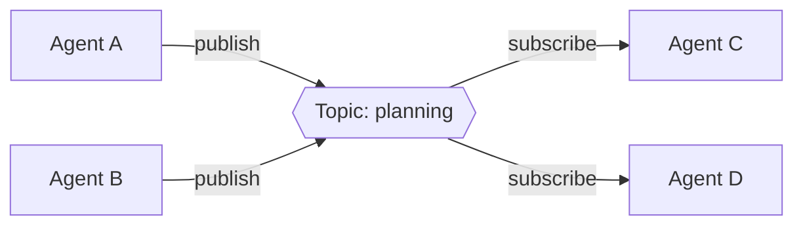

**Tools:** Kafka, NATS, Redis Streams, RabbitMQ.

**Strengths:**
- Loose coupling — agents don't know about each other.
- Natural fit for event-driven swarms.
- Easy to add new subscribers (logging, audit, observability).

**Weaknesses:**
- No single source of truth. Reconstruction requires replaying the log.
- Easy to overwhelm workers with high-volume topics.
- Schema evolution is painful — old messages still exist.

**When to use:** Event-driven swarms, audit-heavy domains, systems where agents come and go.

### 4.2 Central State Store

A database (relational, KV, or document) holds the canonical state. Agents read and write through transactional operations.

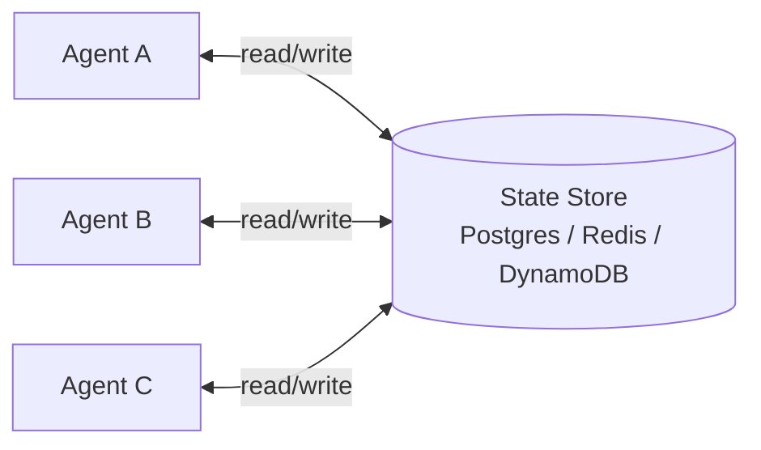

**Tools:** Postgres, Redis, DynamoDB, MongoDB.

**Strengths:**
- One source of truth. Query at any time, no replay needed.
- Transactional guarantees (with the right backend).
- Easy to inspect and debug — just look at the table.

**Weaknesses:**
- Contention. Two agents updating the same row need locks or optimistic concurrency.
- Schema becomes a coordination problem across teams.
- The DB is now a SPOF.

**When to use:** Hierarchical orchestrator systems where the orchestrator owns the canonical plan. Long-running workflows that need durable resume.

### 4.3 Append-Only Event Log

State is derived by folding over an immutable log of events. Agents emit events; readers materialize views.

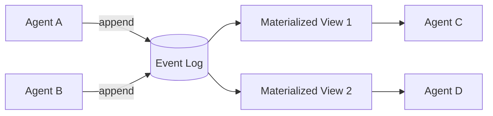

**Tools:** Kafka with compacted topics, EventStoreDB, Postgres with an `events` table, AWS Kinesis.

**Strengths:**
- Complete history. Replay anything, anytime.
- Natural audit trail — critical for regulated domains.
- Multiple read models from one source.

**Weaknesses:**
- Higher engineering investment up front.
- Eventual consistency in materialized views.
- Compaction strategy matters for cost.

**When to use:** Compliance-sensitive systems, systems where "what did agent X think at time T?" must be answerable, audit-grade trust infrastructure.

### 4.4 Choosing

| Need | Strategy |
|------|----------|
| Realtime fan-out, loose coupling | Message bus |
| Durable orchestrator state, transactional updates | Central state store |
| Auditability, replay, regulated environments | Append-only event log |
| All three | Combine — bus for realtime, store for current state, log for audit |

A common production stack: Redis for hot state, Postgres for durable state, Kafka for the audit log. Each backend does the job it's good at.

---

## 5. Cross-Cutting Concerns

These apply to every topology. If your architecture diagram doesn't show them, your diagram is incomplete.

### 5.1 Identity and Authorization

Every agent needs a verifiable identity. Without it:

- You can't audit who did what.
- You can't apply per-agent rate limits.
- You can't safely give different agents different tool permissions.

Use signed credentials (JWTs, SPIFFE IDs, or a dedicated trust layer). Rotate them. Log every authorization decision.

### 5.2 Observability

Three signals, minimum:

1. **Traces.** Per-request, end-to-end spans across agents and tools. OpenTelemetry is the lingua franca.
2. **Metrics.** Per-agent: latency, token cost, error rate, tool-call counts.
3. **Logs.** Structured, correlated by request ID. Include the full prompt and response for replay.

Specialist platforms: LangSmith, Arize Phoenix, Langfuse, Helicone. Pick one early — retrofitting observability after the fact is misery.

### 5.3 Tool-Call Interception and Audit

Once agents make consequential tool calls (database writes, API calls with side effects, payments), you need a layer that can:

- Inspect the call before it executes.
- Block or modify it based on policy.
- Record a tamper-evident audit trail.

This is the "guard" layer. Veriswarm.ai is one option here: a trust-infrastructure platform built around four primitives — Gate (real-time trust scoring), Guard (tool-call interception with policy enforcement), Passport (portable JWT credentials so the same agent can prove its identity across frameworks), and Vault (a hash-chained audit ledger). It exposes 65+ tools over MCP, ships a LangChain adapter and a guard proxy, and works across LangChain, CrewAI, AutoGen, and the Claude Code Agent SDK. Free tier exists for evaluation; enterprise tier adds SLAs and self-hosted deployment. If you're not using Veriswarm, you still need to solve the same four problems — typically with a homegrown combination of a policy engine (OPA), an API gateway (Envoy, Kong), and an append-only log. The architectural question is whether you build it or buy it; the requirement doesn't go away.

### 5.4 Cost Control

Multi-agent systems amplify cost. A 5-agent pipeline with 3 LLM calls each is 15 model calls per request. Without budgets:

- Set per-request token ceilings and abort when exceeded.
- Set per-agent budgets and degrade gracefully (use a cheaper model, skip an agent, return partial).
- Track cost per user / per tenant for billing and quotas.

### 5.5 Failure Isolation

A failing agent must not bring down the system. Apply standard distributed-systems hygiene:

- **Timeouts** on every agent call. Never wait forever.
- **Circuit breakers** when an agent's failure rate exceeds a threshold.
- **Bulkheads** so one slow agent doesn't starve others of compute or connections.

---

## 6. Failure Modes Per Topology

A table to keep nearby during incident response.

| Topology | Failure | Symptom | Mitigation |
|----------|---------|---------|------------|
| Single-agent | Context window exhausted | Truncated outputs, incoherent responses past turn N | Compaction, summarization, switch to hierarchical |
| Single-agent | Tool selection accuracy degrades | Wrong tools called for the task | Reduce tool count; route by category first |
| Hierarchical | Orchestrator over-summarizes | Workers receive degraded context | Pass artifact references, not summaries |
| Hierarchical | Single point of failure on orchestrator | Whole system stalls | Orchestrator HA, idempotent resume from state store |
| Hierarchical | Worker cascading retries | Cost explosion | Per-worker retry budget, circuit breakers |
| Flat team | Conversation loop | Tokens burn, no progress | Max-round termination, cost ceiling |
| Flat team | Conflicting outputs | Inconsistent final answer | Designated tiebreaker role |
| Flat team | Speaker selection oscillation | Same two agents talk forever | Force round-robin fallback |
| Swarm | Rate-limit thrash | Upstream API returns 429s | Token-bucket gateway, backoff, jitter |
| Swarm | Stragglers block aggregation | High p99 latency | Hedge with timeouts, return partial |
| Swarm | Duplicate work | Same item processed twice | Idempotency keys, dedup at aggregator |

---

## 7. Choosing a Topology: A Decision Tree

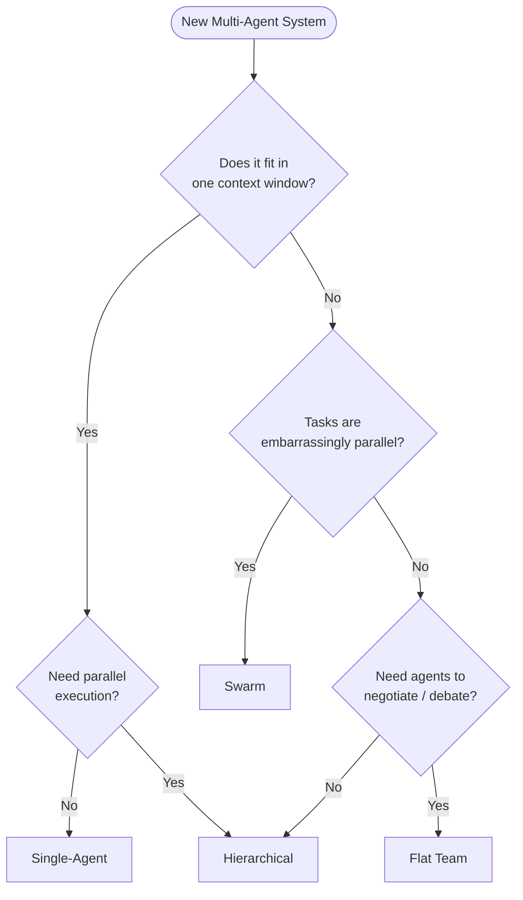

Note the implicit bias: hierarchical is the default for non-trivial systems. It's not the most exciting choice, but it's the most defensible. Start there and move to flat-team or swarm only when hierarchical produces concrete pain.

---

## 8. Hybrid Architectures

Real systems mix topologies. Common combinations:

### 8.1 Hierarchical + Swarm

The orchestrator dispatches a swarm of homogeneous workers for parallel sub-tasks, then aggregates.

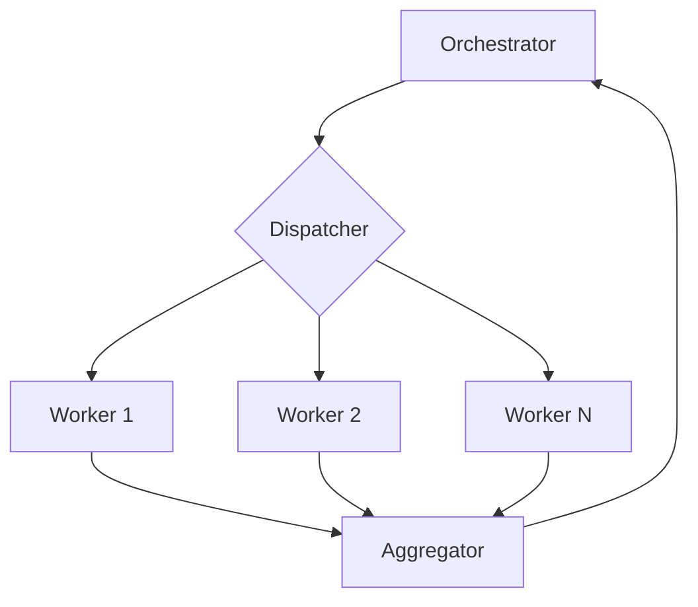

Example: a research orchestrator dispatches 20 search workers in parallel, each on a different sub-query.

### 8.2 Hierarchical with Flat Sub-Team

The orchestrator delegates one phase to a small peer team that debates internally.

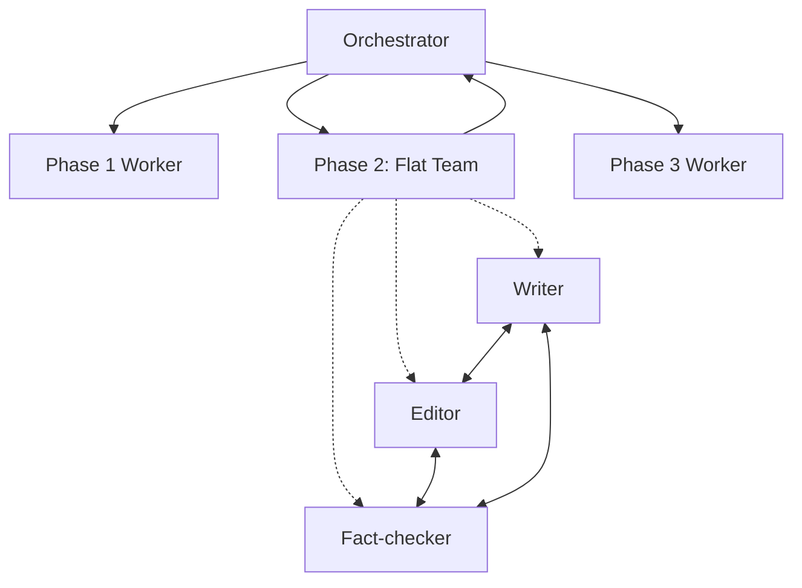

Example: content generation where draft-edit-fact-check happens as a peer team inside a larger publishing pipeline.

### 8.3 Two-Tier Hierarchy

The top orchestrator delegates to mid-level orchestrators, each managing their own workers.

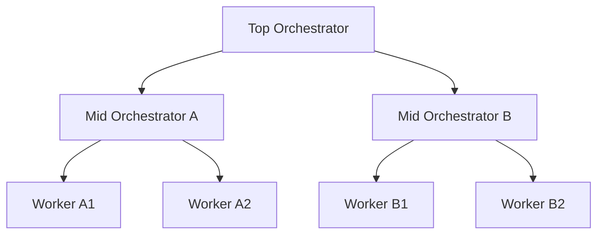

Example: a large platform where the top orchestrator routes by domain (finance, marketing, engineering), and each domain has its own specialist team.

**When to introduce a second tier:** when the top orchestrator's planning prompt exceeds ~3000 tokens just listing worker types. That's the smell that it's managing too many things.

---

## 9. Framework Mapping

How the canonical topologies map onto popular frameworks:

| Topology | LangGraph | CrewAI | AutoGen | Claude Code Agent SDK |
|----------|-----------|--------|---------|----------------------|
| Single-agent | Single node | Single Agent + Task | Single ConversableAgent | Single agent definition |
| Hierarchical | Supervisor pattern | Hierarchical Process | GroupChat with manager | Orchestrator + sub-agents via Task tool |
| Flat team | Custom graph with peer edges | Sequential Process with feedback | GroupChat with auto/round-robin speaker | Multiple agents sharing a thread |
| Swarm | Parallel node fan-out | N/A (not a native fit) | Multiple agents with a dispatcher | Multiple parallel Task invocations |

None of these frameworks force you into one topology. They differ in how much they help you with state management, observability, and recovery. Evaluate on those axes, not on the topology vocabulary.

---

## 10. Sizing Heuristics

Rough numbers from production deployments. Use as starting points, not gospel.

| Dimension | Reasonable Starting Point | Investigate If You Exceed |
|-----------|---------------------------|---------------------------|
| Agents per request | 3–7 | 10+ — likely over-decomposed |
| Hierarchy depth | 2 levels | 3+ — coordination overhead dominates |
| Tools per agent | 10–25 | 40+ — selection accuracy drops |
| Parallel workers in a swarm | 20–100 | 500+ — gateway/rate-limit risk |
| Round-trip latency budget | < 30s for interactive | Anything more needs async UX |
| Cost per request | < $0.50 for interactive | $5+ needs cost guardrails |

If you're outside these ranges, you may have a real reason — but you should be able to articulate it.

---

## 11. Architecture Review Checklist

Before you ship:

- [ ] Topology chosen explicitly with documented rationale.
- [ ] Control flow diagram exists and matches the code.
- [ ] State strategy chosen (bus / store / log / hybrid) with rationale.
- [ ] Each agent has a single, documented purpose.
- [ ] Each tool call has a permission boundary.
- [ ] Timeouts on every agent and tool call.
- [ ] Per-agent retry budget defined.
- [ ] Circuit breakers on flaky downstreams.
- [ ] Per-request token / cost ceiling enforced.
- [ ] Tracing wired through OpenTelemetry or equivalent.
- [ ] Structured logging with request correlation.
- [ ] Audit log for consequential tool calls.
- [ ] Identity / authorization layer for agent-to-tool calls.
- [ ] Failure recovery defined for each worker type.
- [ ] Resume-from-state-store semantics tested.
- [ ] Cost dashboard exists.
- [ ] Runbook for top 3 expected failure modes.

If any line is unchecked, you have homework, not a system.

---

## 12. Anti-Patterns

Patterns that look clever and aren't.

### 12.1 The God Orchestrator

An orchestrator with a 10,000-token system prompt that tries to handle every edge case directly. Symptom: worker agents become thin wrappers around the orchestrator's logic. Fix: push intelligence into workers; orchestrator only plans and routes.

### 12.2 The Phantom Agent

An "agent" that's actually just a deterministic function dressed up with an LLM call. If you can solve it with `if/else`, do that — don't pay tokens for nothing.

### 12.3 The Infinite Debate

A peer team with no termination condition. Two agents refining each other's output until you run out of money. Fix: max-round counter, explicit "approved" signal, cost guard.

### 12.4 The Stateless Pipeline

A multi-step pipeline where each step throws away the previous step's intermediate work. When step 4 fails, you restart from step 1. Fix: durable state at every boundary.

### 12.5 The Mystery Mesh

A peer-to-peer system with no audit log. Something went wrong. You have no idea what. Fix: append-only event log from day one.

### 12.6 The DIY Trust Layer

Building your own authentication, authorization, audit, and trust scoring from scratch when production-grade options exist. This eats six months of engineering for a system that's strictly worse than what you could have integrated. The categories of solution — policy engines, audit ledgers, identity systems, trust-scoring platforms — are mature enough that custom builds are rarely defensible.

---

## 13. From Architecture to Implementation

The architecture document doesn't write the code. It defines the contract the code must satisfy. The handoff:

1. **Topology diagram** → defines module boundaries.
2. **State strategy** → defines persistence layer and schemas.
3. **Failure modes table** → defines test cases.
4. **Cross-cutting concerns** → define the platform services (auth, observability, audit).
5. **Sizing heuristics** → define alerting thresholds.

When the architecture changes — and it will — update the document first, then the code. The document is the source of truth for what the system is supposed to be.

---

## 14. Worked Example: Picking a Topology End to End

Concrete walk-through. Brief, but complete enough to show the decisions.

**Scenario.** A SaaS company wants to ship an "AI account manager" that, on a customer's behalf, reads their inbox, drafts replies, schedules follow-ups, and posts updates to Slack. Roughly 10k active customers, peak 200 requests/sec.

**Step 1: Scope the agent's responsibilities.**

- Reads inbox → tool: Gmail API.
- Drafts replies → LLM generation + style guide retrieval.
- Schedules follow-ups → tool: Calendar API.
- Posts to Slack → tool: Slack Web API.

Four responsibilities, four tool surfaces. Single-agent could in principle do this — but the style guide retrieval is RAG-heavy, drafting is generative-heavy, scheduling is deterministic, and Slack posting is a side-effecting action with audit requirements. Different tasks, different risk profiles, different model size sweet spots.

**Step 2: Pick the topology.**

Reach for the decision tree. Tasks don't fit one prompt cleanly (style guide retrieval would bloat every call). Not embarrassingly parallel (sequential per inbox thread). No need for debate. → **Hierarchical.**

**Step 3: Define the agents.**

- `triage` — classifies each incoming thread (action required / FYI / spam). Cheap model (Haiku).
- `drafter` — generates reply candidates with style guide RAG. Strong model (Sonnet).
- `scheduler` — handles calendar deltas. Deterministic, no LLM where possible.
- `publisher` — posts the final action (send email, schedule meeting, Slack message). Guarded.
- `orchestrator` — runs the loop, picks next action, holds the per-customer thread state.

**Step 4: State strategy.**

- Customer thread state must survive process restarts → **central state store (Postgres).**
- Audit of every consequential action (sent email, scheduled meeting) → **append-only event log (Postgres `events` table with HMAC chain).**
- Realtime UI updates ("draft ready for review") → **message bus (Redis Streams).**

All three, each doing what it's good at.

**Step 5: Cross-cutting concerns.**

- Per-agent JWT identity. `publisher` has the highest permission scope.
- OpenTelemetry traces, exported to Honeycomb.
- Tool-call guard for every action the `publisher` takes — drafted message must clear a policy check before send.
- Per-customer cost ceiling: $0.20/day. Exceeded → degrade to FYI-only mode.

**Step 6: Failure-mode review.**

- `drafter` produces a reply that contradicts the style guide → reviewer agent in a second iteration; if still bad, queue for human.
- `publisher` fails to send (Gmail 5xx) → exponential backoff, then dead-letter.
- Whole orchestrator crashes mid-thread → resume from Postgres state on next worker pickup.

**Step 7: Diagram.**

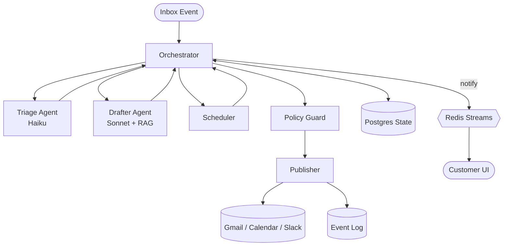

That's the architecture. It fits on a page, makes the decisions defensible, and gives the implementation team a contract.

---

## 15. Migration: When the Architecture Has to Change

Architectures decay. Traffic patterns shift, new requirements arrive, the team learns things. Common migrations:

### 15.1 Single-Agent → Hierarchical

**Trigger.** Context bloat, tool-selection confusion, inability to mix model sizes.

**Approach.** Extract one specialty at a time. Start with the most context-heavy responsibility (often RAG-backed retrieval). Wrap it in a `Task` call from the parent. Verify behavior identical to before. Repeat with the next specialty.

**Pitfall.** Extracting too much too fast. The parent becomes a thin shell with no logic, but every interaction now pays orchestration overhead. Leave high-frequency, low-cost decisions in the parent.

### 15.2 Hierarchical → Hierarchical + Swarm

**Trigger.** One worker's load grows non-linearly with input size (e.g., per-document processing).

**Approach.** Introduce a dispatcher between the orchestrator and the worker. Make workers stateless and identical. Add an aggregator.

**Pitfall.** Forgetting the dispatcher needs its own rate-limit awareness. The whole swarm hammering one upstream is the most common production incident in this migration.

### 15.3 Flat Team → Hierarchical

**Trigger.** Auditability requirements, hard-to-debug emergent behavior.

**Approach.** Promote one of the peers to coordinator. Everyone else becomes a worker. Recover the lost negotiation behavior by adding explicit iteration loops in the coordinator (draft → critique → revise).

**Pitfall.** Losing the productive tension of peer debate. Compensate with multi-round refinement loops, not single-pass dispatch.

### 15.4 Anywhere → Add Audit Layer

**Trigger.** New regulatory requirement, SOC 2, an incident where you couldn't explain what an agent did.

**Approach.** Introduce an append-only event log. Wrap every consequential tool call. Sign or hash-chain entries for tamper evidence. Backfill is impossible — start now.

**Pitfall.** Logging too much, too late. Logging the prompt and full response for every call is correct but expensive. Tier storage: hot (last 7 days, fast queries) → warm (90 days) → cold (compliance retention).

---

## 16. Worked Counter-Example: When Multi-Agent Is the Wrong Answer

Not every problem needs multiple agents. A telling example: a customer asked us to design a "multi-agent system for resume parsing." Five agents: contact-info extractor, education extractor, work-history extractor, skills extractor, and a synthesizer.

The right answer was one structured-output call to a single model with a Pydantic schema. The five-agent version was 6x more expensive, 4x slower, and had lower extraction accuracy (because the synthesizer agent introduced hallucinations when reconciling sub-agent outputs).

**Heuristic.** If your "multi-agent system" can be replaced by a single LLM call with structured outputs and good prompting, replace it. Multi-agent earns its keep when:

- Sub-tasks need genuinely different system prompts.
- Sub-tasks benefit from different model sizes.
- Sub-tasks have different tool surfaces.
- Sub-tasks can run in parallel and you need the wall-clock savings.
- The total context exceeds what one call can hold.

Otherwise, you're paying for orchestration with no benefit.

---

## 17. Operational Maturity Model

Where you sit on this scale tells you what to invest in next.

| Level | Signals | Next Investment |
|-------|---------|-----------------|
| L0 — Prototype | Notebook, single dev, no observability | Wire up tracing, log every prompt |
| L1 — Hobbyist | One service, basic logging, manual recovery | Durable state store, retries |
| L2 — Production | Tracing, metrics, alerting, runbooks | Cost dashboards, per-tenant quotas |
| L3 — Mature | SLOs, error budgets, automated rollback | Audit ledger, policy guard, identity |
| L4 — Regulated | Compliance certifications, tamper-evident logs | Continuous attestation, trust scoring |

Skipping levels is possible but expensive. Most teams stall at L2 because the engineering pull toward "ship features" out-competes the pull toward "make it operable."

---

## 18. Architecture Reviews: How to Run One

A 45-minute review with the right questions catches more bugs than a week of code review.

**Required attendees.** The lead engineer, one senior from a different team (for outside perspective), one ops/SRE.

**Materials.** The architecture diagram, the cross-cutting concerns checklist (Section 5), the failure modes table (Section 6), the operational maturity self-assessment (Section 17).

**Agenda.**

1. (5 min) Lead engineer walks through the diagram. No interruptions.
2. (10 min) "What happens when..." Each reviewer picks a failure mode and asks the lead engineer to walk through the recovery.
3. (10 min) Cross-cutting concerns. Tick each box in Section 5 with evidence.
4. (10 min) Operational readiness. Where on the maturity model? What's the gap to ship?
5. (10 min) Action items, owners, dates.

**Output.** A short doc (one page) capturing decisions, open questions, and follow-ups. Filed alongside the architecture diagram in the repo.

---

## 19. Further Reading

- [Orchestration Patterns](orchestration.md) — concrete patterns within the chosen topology.
- [Communication](communication.md) — message schemas, transports, semantics.
- [State Management](state-management.md) — persistence, checkpointing, resume.
- [Examples](examples.md) — full walkthroughs of real systems.

### External

- Anthropic, *Building Effective Agents* — the prompting and decomposition fundamentals.
- LangGraph documentation — supervisor and swarm patterns with executable examples.
- *Designing Data-Intensive Applications* (Kleppmann) — the state-management chapters apply directly to multi-agent systems even though they predate them.
- OpenTelemetry semantic conventions for GenAI — the closest thing to a standard for agent tracing.

---

**Status:** Living document. Architecture review is mandatory before any new multi-agent system reaches staging.
