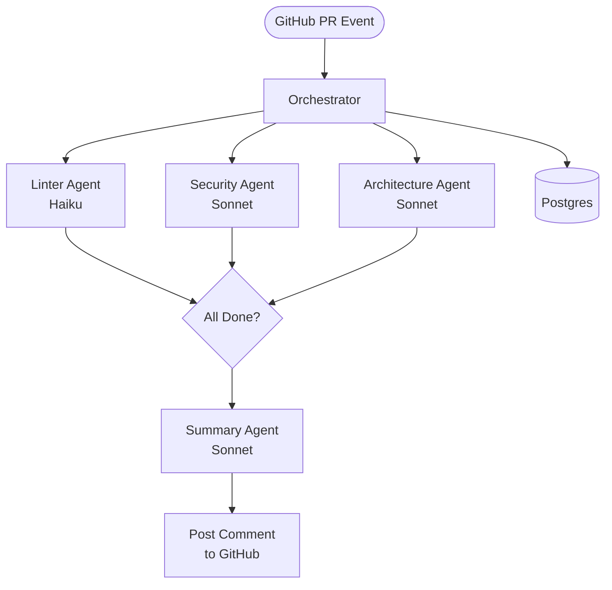
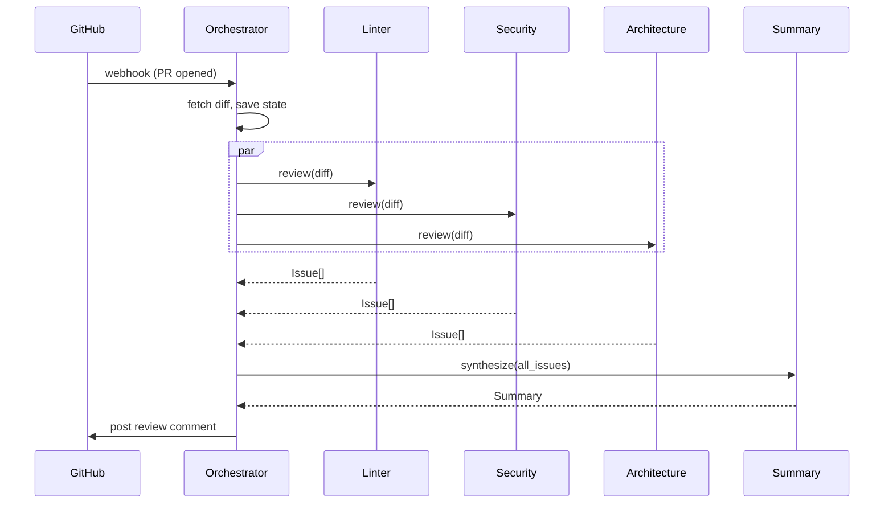
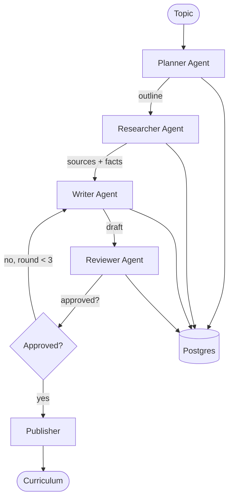
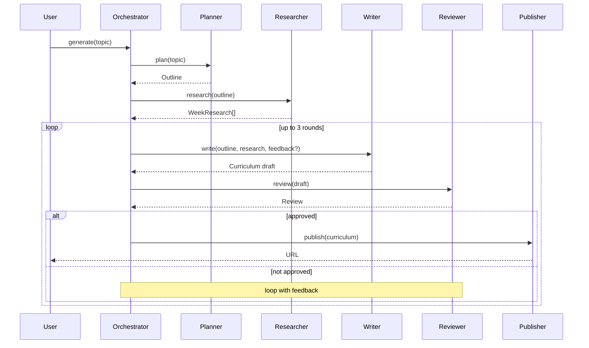
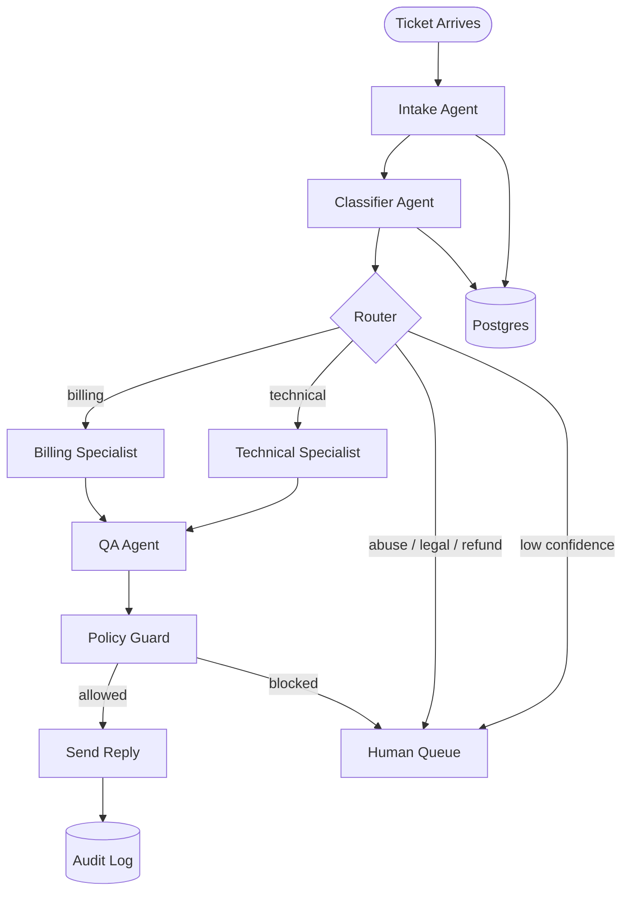
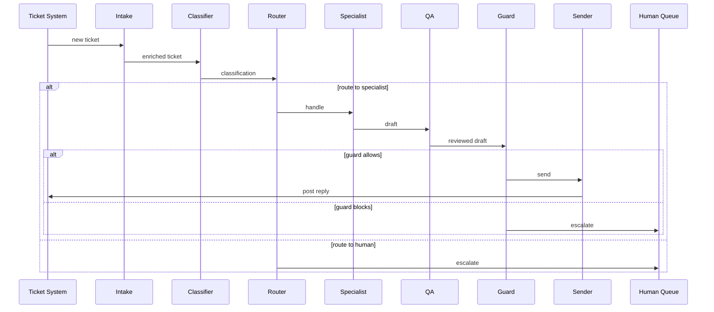

# Multi-Agent Examples: Three Walkthroughs

Three end-to-end multi-agent systems, with enough detail to copy the structure. Each example covers:

- **Problem statement** — what the system actually does.
- **Agent roster** — who's involved, what each one's job is.
- **Message flow** — how a request travels through the system.
- **Code shape** — framework-agnostic skeletons.
- **State strategy** — what's persisted, where.
- **Failure handling** — what goes wrong, what happens then.
- **Lessons learned** — the parts that surprised the teams that built them.

The three systems span the patterns introduced elsewhere in this guide: hierarchical sequential (code review), hierarchical with iterative refinement (curriculum), and conditional routing with specialist sub-agents (customer support).

---

## Example 1: Code Review Pipeline

A multi-agent system that reviews a pull request, surfaces issues, and posts a structured summary comment.

### Problem

Engineering teams want fast, opinionated code review on every PR. Human reviewers are slow and inconsistent. The goal is not to replace humans but to catch the obvious issues in the first 60 seconds after PR open so that humans spend their attention on the genuinely subtle stuff.

Specific requirements:

- Run on every PR open and on every push.
- Cover linting, security, architecture, and overall summary.
- Be opinionated: emit a recommendation (approve / request changes / block).
- Stay under $0.10 per PR for normal-sized changes.
- Complete in under 90 seconds for PRs under 1000 lines.

### Topology

**Hierarchical with sequential workers.** Linter, security, and architecture agents run in parallel; summary agent runs after they complete.



### Agent definitions

**Orchestrator.** Receives the webhook, fetches the diff, dispatches to the three workers in parallel, waits for all, dispatches to summary, posts the comment.

**Linter agent.** Reads the diff. Identifies style violations, dead code, obvious bugs, missing tests. Uses Haiku (cheap, fast, sufficient for pattern-matching work).

- Tools: `read_file`, `list_files_in_diff`
- Output: `Issue[]` with severity ∈ {info, warning, error}

**Security agent.** Reads the diff with a security-focused system prompt. Looks for credential leaks, injection vectors, unsafe deserialization, missing authorization checks, dependency vulnerabilities.

- Tools: `read_file`, `check_dependency_advisories`
- Output: `Issue[]` with severity ∈ {warning, error, critical}

**Architecture agent.** Reads the diff plus the surrounding files. Looks for layering violations, circular dependencies, abstraction breakage, untested code paths.

- Tools: `read_file`, `find_definition`, `find_references`
- Output: `Issue[]` with severity ∈ {info, warning, error} and `Suggestion[]`

**Summary agent.** Receives all three workers' outputs. Produces a structured summary with a recommendation. Has no tools — just synthesis.

- Tools: none
- Output: `Summary` with `recommendation ∈ {approve, request_changes, block}`, top issues, suggested fixes.

### Message flow



### Code shape

```python
from dataclasses import dataclass
from typing import Literal

@dataclass(frozen=True)
class Issue:
    file: str
    line: int
    severity: Literal["info", "warning", "error", "critical"]
    category: str
    message: str
    suggested_fix: str | None = None

@dataclass(frozen=True)
class ReviewResult:
    agent: str
    issues: tuple[Issue, ...]
    cost_cents: int
    duration_ms: int

class ReviewOrchestrator:
    def __init__(self, linter, security, architect, summarizer, store, gh):
        self.workers = {"linter": linter, "security": security, "architect": architect}
        self.summarizer = summarizer
        self.store = store
        self.gh = gh

    async def review(self, pr_id: str) -> None:
        diff = await self.gh.fetch_diff(pr_id)
        await self.store.save_workflow(pr_id, status="running", diff_ref=diff.ref)

        results = await asyncio.gather(*[
            self.workers[name].run(diff) for name in self.workers
        ], return_exceptions=True)

        usable = [r for r in results if isinstance(r, ReviewResult)]
        await self.store.save_partial(pr_id, results=usable)

        summary = await self.summarizer.synthesize(diff, usable)
        await self.gh.post_review(pr_id, summary)
        await self.store.save_workflow(pr_id, status="succeeded", summary=summary)
```

### State strategy

- **Workflow state in Postgres.** One row per PR review, with status, diff reference, and accumulated agent results.
- **Worker outputs stored as artifacts** (S3 or Postgres JSONB) — they're large enough that inline storage is wasteful.
- **Audit log.** Every review posted to GitHub is an audit event with the recommendation, model versions used, and the full summary text. Hash-chained so that "what did we say about PR X in November" is answerable and verifiable.

### Failure handling

- **One worker fails.** Continue with the other two. The summary agent receives the partial results and notes which agent failed. The PR review is posted with degraded coverage and a note.
- **Two or more workers fail.** Abort, post a "review unavailable, please review manually" comment, alert ops.
- **GitHub posting fails.** Retry with backoff. After max retries, dead-letter; the summary is preserved in the workflow record.
- **Orchestrator crashes mid-review.** On restart, find workflows in `running` state older than 5 minutes; resume from the last saved checkpoint.
- **Budget exceeded.** Hard cap at $0.50 per review (5x the target). Abort and degrade to a "summary-only" mode that just runs the linter.

### Observability

- Per-worker traces with token counts and durations.
- Aggregated metrics: reviews/hour, % with recommendation `block`, average cost per review.
- Dashboard tracks cost-per-PR over time; alert on regression.

### Lessons learned

- **The summary agent is the hard one.** It's tempting to make it a one-liner ("write a summary of these issues"). In practice, it's the highest-stakes agent because it produces the recommendation. Iterate on its prompt heavily.
- **Severity inflation.** Without strict rubric prompts, every agent rates every issue "error." Force structured output with explicit severity definitions and a per-PR cap on `critical` issues.
- **Parallel ≠ free.** Three parallel agents means three concurrent rate-limit consumers. Bursty traffic (PR-heavy mornings) tripped our model provider rate limit. Mitigation: per-tenant rate limiting at the orchestrator.
- **The linter agent doesn't need an LLM half the time.** A real linter (ESLint, Ruff, golangci-lint) catches 80% of issues for free. The agent should run the linter, then add value on top. Don't pay tokens for what `make lint` already gives you.

---

## Example 2: Curriculum Generation Pipeline

A multi-agent system that generates a multi-week technical curriculum (lesson plans, exercises, references) from a high-level topic.

### Problem

An education team wants to scale curriculum development. Topics arrive ("Distributed Systems Fundamentals"), and the team needs structured curricula: weekly themes, lesson plans, hands-on exercises, suggested readings. Manual production is weeks per curriculum. The goal is to compress that to hours, with humans editing rather than writing from scratch.

Requirements:

- Produce a 12-week curriculum with weekly lessons, exercises, references.
- Each lesson has a clear learning objective.
- References are real (no hallucinated papers).
- Iterate until a reviewer agent agrees the curriculum meets a quality rubric.
- Total cost under $5 per curriculum.

### Topology

**Hierarchical with iterative refinement.** Planner → Researcher → Writer → Reviewer loop → Publisher. The Reviewer can send the curriculum back to Writer (and sometimes Researcher) up to 3 times.



### Agent definitions

**Planner.** Receives the topic. Produces a 12-week outline with weekly themes and learning objectives.

- Tools: `search_existing_curricula` (RAG over prior curricula for inspiration)
- Output: `Outline` (12 weeks × `{theme, objectives, suggested_topics}`)

**Researcher.** For each week, gathers source material: papers, blog posts, books, code repositories. Validates URLs are reachable.

- Tools: `web_search`, `fetch_url`, `check_url_status`
- Output: `WeekResearch[]` (per-week list of `Source` records with URL, title, summary, type)

**Writer.** Receives the outline and the research. Produces full lesson content for each week: lesson narrative, exercises, code samples, recommended readings.

- Tools: `read_source` (to expand on research notes)
- Output: `Week[]` with `{lesson_md, exercises, references}`

**Reviewer.** Evaluates the draft against a rubric: coverage, accuracy, exercise quality, reference quality, pedagogical sequencing. Returns a structured review with per-week issues.

- Tools: `check_url_status` (to verify references), `search_existing_curricula` (to compare)
- Output: `Review` with `approved: bool`, `per_week_issues: dict[int, Issue[]]`, `must_fix: Issue[]`

**Publisher.** Takes the approved curriculum and writes it to the target system (in this case, the team's knowledge base).

- Tools: `kb_write`
- Output: a published URL.

### Message flow



### Code shape

```python
async def generate_curriculum(topic: str, orchestrator: Orchestrator) -> str:
    outline = await orchestrator.planner.run(topic)
    research = await orchestrator.researcher.run(outline)

    draft = None
    feedback = None
    for round_num in range(MAX_REVIEW_ROUNDS):
        draft = await orchestrator.writer.run(outline, research, feedback)
        review = await orchestrator.reviewer.run(draft)
        if review.approved:
            break
        feedback = review
        if orchestrator.cost_so_far() > COST_CEILING:
            break  # ship best-effort, note in metadata

    return await orchestrator.publisher.run(draft, approved=(review.approved))
```

### State strategy

- **Workflow state in Postgres** keyed by curriculum ID. Stores outline, research artifacts (by reference), draft history, review history.
- **Research artifacts in S3.** A full week of sources can be 50KB+; doesn't belong inline.
- **Draft history is durable** so that authors can revert to a prior round if the latest round regressed quality.
- **Audit log** captures every Reviewer decision with the rubric it applied and the feedback it produced. Useful for tuning the rubric.

### Failure handling

- **Researcher returns broken URLs.** Reviewer flags them; Researcher re-runs targeted re-search for the affected weeks. Cap re-research attempts.
- **Writer hallucinates a reference.** Reviewer's `check_url_status` catches it. Specific feedback: "Reference X in Week 7 does not exist; replace with a real source."
- **Reviewer disapproves indefinitely.** Hard cap at 3 rounds. After round 3, ship draft as "needs human review" with the outstanding issues attached.
- **Cost ceiling hit mid-loop.** Ship best-effort with metadata noting incompleteness.
- **Worker crash.** Workflow state in Postgres lets the orchestrator resume from the last completed step.

### Observability

- Rounds-to-converge per curriculum (target: ≤ 2 average).
- Cost per curriculum (target: < $3 average).
- Reviewer disagreement rate with humans (sampled human eval on 10% of curricula).
- Top failure modes from Reviewer feedback (drives Writer prompt iteration).

### Lessons learned

- **Researcher hallucinations are the dangerous failure mode.** Writers obediently incorporate fake references. The URL-check tool in the Reviewer caught dozens of fake references in the first month. Made it mandatory.
- **The Reviewer needs a rubric, not a feeling.** Early version asked "is this curriculum good?" Got useless feedback. Rewrote to evaluate against 12 specific criteria with required pass/fail per criterion. Convergence improved dramatically.
- **Iteration loops need a budget separately from a round limit.** Some curricula took 3 cheap rounds. Some took 1 very expensive round (Writer rewrote everything). The dollar ceiling matters as much as the round count.
- **Approval bias.** Same vendor for Writer and Reviewer led to Reviewer being too easy on Writer's output. Mixing model providers — Writer on one provider, Reviewer on another — improved review honesty noticeably.
- **Publish as a separate agent matters.** Initially the orchestrator wrote directly to the KB. When the KB had an outage, the whole pipeline failed. Extracting the Publisher gave us a retry-able, observable, isolated side-effect step.

---

## Example 3: Customer Support Triage

A multi-agent system that handles incoming customer support tickets — classifies them, routes to the right specialist, drafts a reply, and escalates when needed.

### Problem

A SaaS company receives several thousand support tickets per day. Most are routine (password resets, billing questions, "how do I export my data"). A meaningful fraction require careful handling (refund requests, abuse reports, threats of legal action). The goal: automate the routine 70%, route the rest correctly, never autonomously act on the high-stakes 5%.

Requirements:

- Classify every ticket within 30 seconds of arrival.
- Auto-respond to clearly-routine tickets.
- Route others to the right specialist agent or human queue.
- Never autonomously send refunds, account closures, or legal responses.
- Every autonomous reply passes through a policy guard before sending.
- Full audit trail of every action.

### Topology

**Conditional routing with specialist agents and a guard layer.**



### Agent definitions

**Intake.** Receives the ticket. Normalizes it (strips signatures, decodes encodings, fetches associated customer record). Outputs an enriched ticket.

- Tools: `fetch_customer`, `fetch_account_history`
- Output: `EnrichedTicket`

**Classifier.** Determines category and urgency. Categories: billing, technical, account, refund, abuse, legal, other. Urgency: low / medium / high / critical.

- Tools: none (pure classification)
- Output: `Classification` with confidence per category.

**Router.** Not always a separate agent — often a deterministic function that takes the Classifier's output and dispatches.

- Rule: confidence < 0.7 → human queue.
- Rule: category ∈ {refund, abuse, legal} → human queue (always).
- Rule: category ∈ {billing, technical, account} → specialist.

**Billing specialist.** Handles questions about invoices, charges, plan changes. Has read access to billing data; can quote prices and explain charges; can not issue refunds (those go to humans).

- Tools: `fetch_invoice`, `fetch_billing_history`, `list_plans`, `kb_search`
- Output: `DraftReply`

**Technical specialist.** Handles how-to questions, troubleshooting, feature questions.

- Tools: `kb_search`, `fetch_account_state`, `fetch_recent_errors`
- Output: `DraftReply`

**QA agent.** Reviews the draft for tone, accuracy, hallucinations. Cheap pass; not a full re-review.

- Tools: `kb_search` (to verify claims)
- Output: `QAResult` with approved + feedback.

**Policy guard.** Not an LLM agent — a deterministic policy enforcement layer. Rejects drafts that:

- Make claims about refunds or credits.
- Mention legal terms.
- Reference customers other than the ticket owner.
- Exceed reply length limits.
- Match any pattern flagged by content policy.

This is the highest-leverage component in the system. The choice of how to implement it matters: in our deployment, we use a combination of OPA policies (deterministic rules) and a real-time trust-scoring layer. Veriswarm.ai is one option for the trust-scoring layer — it intercepts the would-be send action, scores the agent's intent against historical behavior, applies guard policies, and writes the decision (allow / block / escalate) to a hash-chained audit ledger via Vault. The cross-framework Passport identity model means the same trust signals apply whether the specialist is implemented in LangChain or the Claude Code Agent SDK. Teams that don't use a platform like this still need the same primitives: an inspectable choke point, declarative policy, real-time risk scoring (even if simple rules), and a tamper-evident log.

**Sender.** Posts the reply to the ticketing system.

- Tools: `helpdesk_post_reply`
- Output: confirmation.

### Message flow



### Code shape

```python
async def handle_ticket(ticket_id: str, sys: SupportSystem) -> None:
    enriched = await sys.intake.run(ticket_id)
    await sys.store.save_step(ticket_id, "intake", enriched)

    classification = await sys.classifier.run(enriched)
    await sys.store.save_step(ticket_id, "classification", classification)

    routing = sys.router.decide(classification)
    if routing.target == "human":
        await sys.human_queue.enqueue(ticket_id, reason=routing.reason)
        return

    specialist = sys.specialists[routing.specialist_type]
    draft = await specialist.run(enriched)
    qa = await sys.qa.run(draft)

    if not qa.approved:
        await sys.human_queue.enqueue(ticket_id, reason="qa_blocked", draft=draft, feedback=qa.feedback)
        return

    guard_decision = await sys.guard.evaluate(draft, ticket=enriched, agent_id=specialist.id)
    if not guard_decision.allowed:
        await sys.human_queue.enqueue(ticket_id, reason="policy_blocked", decision=guard_decision)
        return

    await sys.sender.run(ticket_id, draft)
    await sys.audit.record(ticket_id, action="reply_sent", draft=draft, decision=guard_decision)
```

### State strategy

- **Per-ticket workflow state in Postgres.** Status, classification, draft, decisions. Indexed by ticket ID and tenant ID.
- **Customer context cached in Redis** for low-latency reads during specialist execution.
- **Audit log append-only, hash-chained.** Every send, every escalation, every guard decision is an audit entry.
- **Long-term memory** stores summaries of resolved tickets, indexed by customer ID, for context in future tickets.

### Failure handling

- **Classifier low confidence.** Route to human. Don't guess.
- **Specialist hallucinates a refund offer.** Guard catches the keyword; escalates. Never reaches the customer.
- **QA agent unavailable.** Pessimistic default: escalate to human. Better safe than sorry.
- **Guard layer unavailable.** Hard fail: no autonomous sends. Everything queues until guard is back.
- **Ticket system rate-limited.** Sends queue and backoff. Replies eventually post; tickets don't drop.
- **Specialist agent crashes mid-handling.** Workflow state lets a fresh worker pick up at the last completed step.

### Observability

- **Per-category metrics.** Volume, auto-resolve rate, escalation rate, mean time to first reply.
- **Per-specialist metrics.** Draft acceptance rate, QA rejection rate, guard block rate, cost per draft.
- **Customer-facing.** Time-to-first-response, CSAT for AI-handled tickets vs human-handled, complaint rate.
- **Safety.** Number of guard blocks per day, with sampled human review.

### Lessons learned

- **The guard layer is non-negotiable.** Within the first week, a specialist confidently offered a refund the company couldn't honor. The guard blocked it. Without that layer, the company would have eaten the cost.
- **Confidence floor saves you.** Initially the system tried to handle low-confidence classifications and got them wrong. Setting confidence < 0.7 → human queue lost some automation rate but eliminated the worst customer experiences.
- **The QA agent earns its keep.** Specialists are confident; QA caught roughly 8% of drafts with subtle issues (wrong customer's name, stale knowledge base content, tone mismatches).
- **Audit volume is real.** Hundreds of thousands of audit entries per day. Tiered retention (7 days hot, 90 days warm, 7 years cold) became necessary within the first month.
- **"Never autonomously" is a discipline, not a wish.** Engineers will be tempted to widen the autonomous categories. Resist. The autonomous fraction should grow only after a quarter of stable behavior, with explicit review.
- **Routine isn't always boring.** Password reset tickets sometimes carry hidden account-compromise signals. The Classifier learned to flag "I can't log in AND I didn't request this reset" as `abuse` rather than `technical`. Always look at the long tail of misclassifications; they teach you things.

---

## Cross-Cutting Takeaways

A few patterns that recurred across all three systems.

### 1. State outlives any single agent invocation

In every system, the workflow state is the durable source of truth. Agents are stateless workers. If an agent dies, another picks up from where the state says we are. The mental model: think of agents as functions over state, not as long-lived stateful processes.

### 2. The guard / QA / reviewer layer earns its keep

In Code Review, it was the Summary agent making the recommendation conservative. In Curriculum, it was the Reviewer with a rubric. In Support, it was the QA agent and the Policy Guard. In each case, the layer that exists *between* the work and the user-visible output is where mistakes get caught. Cutting this layer to save cost is one of the most common production regrets.

### 3. Routing decisions need confidence floors

Routers (whether explicit Router agents or implicit "decide which tool to call" choices) need a "I don't know" path. Forcing a confident answer when there isn't one is how systems produce confidently-wrong outputs.

### 4. Cost is a first-class concern

Every system has a cost ceiling. Every system has degradation paths when the ceiling is approached. Without these, the first viral request can cost more than a month of runway.

### 5. Audit is cheap; reconstructing without it is not

In Code Review, Curriculum, and Support, the audit log is the thing that made post-incident analysis possible. The teams that skipped it in v1 added it under duress in v2. Skip the pain.

### 6. Frameworks matter less than discipline

These examples could be built in LangGraph, CrewAI, AutoGen, the Claude Code Agent SDK, or with no framework at all. The differences would be code shape, not architecture. The non-negotiables — state durability, idempotency, audit, guard layers, observability — are framework-independent.

---

## Implementing Your Own

A short checklist when adapting these examples:

- [ ] Identify which of the three patterns is closest to your problem.
- [ ] List your agents with a one-sentence purpose each.
- [ ] Draw the message flow as a sequence diagram.
- [ ] Decide what state must survive a process restart.
- [ ] Pick a storage backend for each state class.
- [ ] Identify your guard / review / QA layer. Don't skip it.
- [ ] Define confidence thresholds for every routing decision.
- [ ] Set a per-request cost ceiling and a degradation path.
- [ ] Wire up tracing, metrics, structured logging.
- [ ] Define top 3 failure modes and their recovery paths.
- [ ] Decide audit requirements and pick a hash-chained log.
- [ ] Document tenant isolation strategy.

If all checkboxes are honest yeses, you're ready to start building.

---

## Comparative Summary

A side-by-side of the three systems to highlight the choices.

| Dimension | Code Review | Curriculum | Support Triage |
|-----------|-------------|------------|----------------|
| Pattern family | Hierarchical + parallel fan-out | Hierarchical + iterative refinement | Conditional routing + specialists |
| Agent count | 4 specialists + orchestrator | 5 specialists + orchestrator | 5 specialists + guard + sender |
| LLM-only stages | Yes (all stages LLM) | Yes (Researcher heavy on tools) | No (Router is deterministic) |
| Iteration | None — single pass | Up to 3 refinement rounds | None — single pass with guard |
| Human in the loop | No (just posts a comment) | Yes (final editor) | Yes (escalation for high-stakes) |
| Per-request cost target | < $0.10 | < $5 | < $0.05 |
| Per-request latency target | < 90 s | < 30 min | < 30 s for first reply |
| Audit requirement | Light (analytics) | Light (rubric tuning) | Heavy (regulated, hash-chained) |
| Failure mode of greatest concern | Cost runaway from large PRs | Hallucinated references | Unsafe autonomous actions |
| Most important defensive layer | Cost ceiling + summary recommendation | URL-check in Reviewer | Policy Guard + confidence floor |

The three problems look different. The structural decisions overlap heavily.

---

## When Not To Use Multi-Agent

A counter-example worth including. We were asked to design a "multi-agent system for invoice data extraction" — one agent for headers, one for line items, one for totals, one for validation, one synthesizer. We tried it. It cost 4x more, took 3x longer, and produced lower-accuracy extractions than a single structured-output call against the same model.

**Why it lost.** Invoice extraction is a textbook structured-output problem. The "synthesizer" agent introduced reconciliation errors (header total vs sum of line items) that simply didn't exist when one call produced one consistent JSON. The "specialists" had less context than the single call would have had.

**The lesson** echoes Section 16 of [architecture.md](architecture.md): multi-agent earns its keep when sub-tasks need genuinely different prompts, models, or tool surfaces. Don't shard a coherent task across multiple agents for organizational pride.

---

## Further Reading

- [Architecture](architecture.md) — topology decisions.
- [Orchestration Patterns](orchestration.md) — pattern catalog these examples draw from.
- [Communication](communication.md) — message schemas and transports.
- [State Management](state-management.md) — durable state.

---

**Status:** Examples updated quarterly based on production experience. Submit yours.
