# Orchestration Patterns

A catalog of the orchestration patterns that actually show up in production multi-agent systems. Each entry covers when to reach for the pattern, when to avoid it, what the code shape looks like, and the failure modes to design against.

These are patterns, not frameworks. You can implement any of them in LangGraph, CrewAI, AutoGen, the Claude Code Agent SDK, or with no framework at all. The thinking is portable; the syntax varies.

---

## 1. Why a Pattern Catalog

Multi-agent design suffers from two recurring failures:

1. **Pattern envy.** The team picks a clever pattern (debate, hierarchical critique) because it sounds impressive, then spends three months making it stable.
2. **Pattern blindness.** The team reinvents sequential pipelines because they've never seen the alternatives named.

A shared vocabulary fixes both. When someone says "we need a map-reduce fan-out with a critique loop on the aggregator," everyone in the room knows what's going to be built.

The patterns below are ordered roughly by complexity. Start at the top. Move down only when the simpler pattern is provably insufficient.

---

## 2. Sequential Pipeline

The simplest pattern. Agents run in a fixed order, each consuming the previous agent's output.

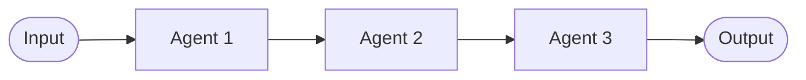

### When to use

- Tasks have a strict, linear dependency.
- Each step has a clear, narrow purpose.
- Throughput requirements are modest (one request at a time per pipeline).

### When to avoid

- Steps are independent — parallel fan-out is cheaper and faster.
- The pipeline is more than ~5 steps — coordination becomes brittle.
- Steps need to retry or skip dynamically.

### Code shape

```python
def sequential_pipeline(request, agents: list[Agent]) -> Result:
    state = {"input": request}
    for agent in agents:
        result = agent.run(state)
        if result.failed:
            raise PipelineFailure(stage=agent.name, error=result.error)
        state[agent.name] = result.output
    return state
```

Properties worth calling out:
- **State accumulates.** Each agent sees the full history. Be deliberate about what gets passed on — verbose intermediate outputs balloon downstream cost.
- **Fail-fast by default.** If stage 3 fails, you don't run 4 and 5.
- **No automatic retry.** Recoverable failures should be handled inside the agent or wrapped explicitly.

### Failure modes

- **Cascading garbage.** Stage 1 produces a low-quality output. Stages 2–5 dutifully process it. Mitigation: per-stage validation gates.
- **Cost blow-up.** Each stage rereads accumulated state. Mitigation: pass artifact references, not full content; project only what the next stage needs.
- **Silent data loss.** Stage N drops a field that stage N+2 needed. Mitigation: schema-validated handoffs.

### Real example

The classic content publishing pipeline: outline → draft → fact-check → polish → publish. Each stage's output is the next stage's input. Total wall-clock time is the sum of stage latencies, which is the main argument against sequential when latency matters.

---

## 3. Parallel Fan-Out / Fan-In

Multiple agents run simultaneously on independent sub-tasks. Their outputs are aggregated.

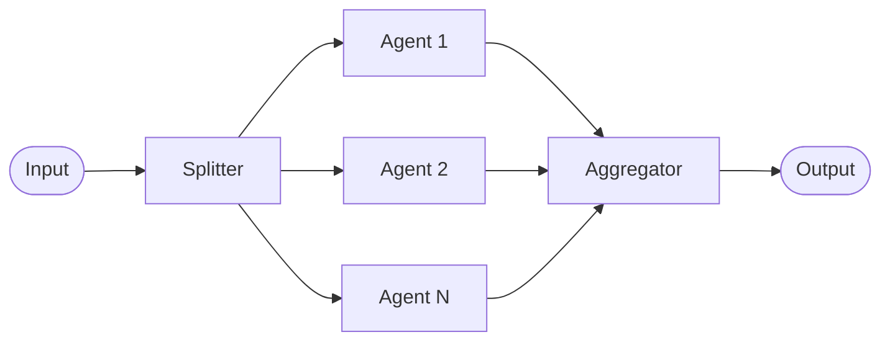

### When to use

- Sub-tasks are genuinely independent (no shared state).
- Wall-clock latency matters more than total cost.
- The aggregator can sensibly combine partial outputs.

### When to avoid

- Sub-tasks have hidden dependencies — they'll interact in surprising ways.
- The aggregator becomes a bottleneck or a hallucination magnet.
- Per-worker rate limits would be tripped by parallel load.

### Code shape

```python
async def fan_out_fan_in(request, splitter, workers, aggregator) -> Result:
    sub_tasks = splitter.split(request)             # decompose the work
    futures = [asyncio.create_task(worker.run(t)) for t, worker in zip(sub_tasks, workers)]
    results = await asyncio.gather(*futures, return_exceptions=True)
    return aggregator.combine(request, results)
```

Things to get right:
- **Bounded concurrency.** Don't fan out 500 workers to a 10-RPS upstream. Use a semaphore.
- **Partial failure handling.** Use `return_exceptions=True` and let the aggregator decide what counts as a usable result set.
- **Deterministic aggregation.** The aggregator should produce the same output regardless of worker completion order.

### Failure modes

- **Straggler latency.** p99 is dominated by the slowest worker. Mitigation: hedged requests, timeout with partial aggregation.
- **Rate-limit thrash.** Mitigation: token-bucket gateway in front of shared resources.
- **Aggregator hallucination.** When asked to summarize 20 worker outputs, the aggregator invents content. Mitigation: structured outputs, explicit "do not invent" prompting, fact-check pass.

### Real example

Multi-source research: "summarize the state of vector databases." Spin off 10 workers, each researching one product (Pinecone, Weaviate, Qdrant, Milvus, ...). Aggregator builds the comparison matrix. Parallel cuts the wall-clock from 10 × per-worker latency down to ~1 × per-worker latency.

---

## 4. Conditional Routing

A router agent inspects the input and dispatches to one of several specialist agents.

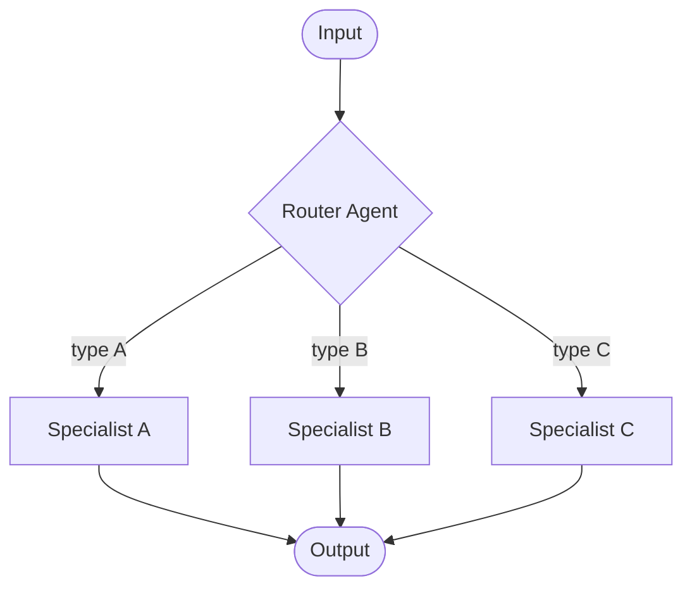

### When to use

- Inputs have distinct categories that need different handling (refund vs. technical support vs. sales).
- A single agent with all tools would have poor tool-selection accuracy.
- Cost matters: route cheap queries to cheap models.

### When to avoid

- Routing decisions are simple keyword matches — use code, not an LLM.
- The number of routes exceeds ~10 — accuracy degrades; consider a two-tier router.

### Code shape

```python
def conditional_route(request, router: Agent, specialists: dict[str, Agent]) -> Result:
    decision = router.classify(request)            # returns a typed RoutingDecision
    if decision.confidence < CONFIDENCE_FLOOR:
        return specialists["fallback"].run(request)
    specialist = specialists.get(decision.route)
    if specialist is None:
        raise UnknownRoute(decision.route)
    return specialist.run(request, hint=decision.reasoning)
```

Notes:
- **Confidence floor.** Always have a fallback path for low-confidence routing. Otherwise the router will confidently send the wrong query to the wrong specialist.
- **Typed decisions.** Use structured outputs (Pydantic, Zod, JSON schema) so the router cannot invent route names.
- **Pass the reasoning.** The specialist often benefits from seeing why the router picked it.

### Failure modes

- **Over-confident misrouting.** Mitigation: confidence threshold + fallback.
- **Route schema drift.** Router learns about a route that doesn't exist. Mitigation: enum-constrained outputs.
- **Hot route saturation.** One route gets 90% of traffic and its specialist is the bottleneck. Mitigation: scale specialists independently.

### Real example

Customer support intake. The router classifies tickets into billing, technical, abuse, and other. Each specialist has its own tool surface (billing system access for billing, knowledge base for technical, ban tooling for abuse). A single agent with all four tool surfaces would be slow and error-prone.

---

## 5. Iterative Refinement (Critique / Revise)

An agent produces a draft. A critic agent reviews. The first agent revises. Loop until a quality gate is met or a budget is exhausted.

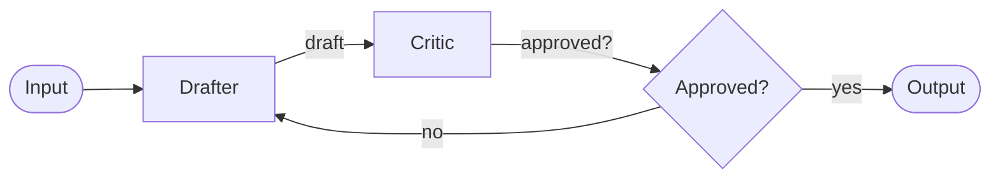

### When to use

- Output quality is more important than latency.
- Quality is checkable (the critic can articulate what's wrong).
- The work has a clear "good enough" criterion.

### When to avoid

- The critic and drafter agree too easily — you get no real iteration.
- There's no termination condition — debates loop forever.
- The cost of N iterations exceeds the benefit.

### Code shape

```python
def iterative_refine(request, drafter, critic, max_rounds=3, cost_ceiling=1.0):
    draft = drafter.create(request)
    for round_num in range(max_rounds):
        review = critic.review(request, draft)
        if review.approved:
            return draft
        if cost_so_far() > cost_ceiling:
            return draft  # accept current, log "ceiling hit"
        draft = drafter.revise(request, draft, review.feedback)
    return draft  # accept best-effort after max rounds
```

Things to get right:
- **Termination conditions.** Always at least two: max rounds and cost ceiling. Optionally a third: "no change in review feedback round-over-round" (the drafter and critic have converged on a disagreement).
- **Critic specificity.** Vague feedback ("make it better") produces no convergence. Force the critic to emit structured, actionable issues.
- **Don't conflate drafter and critic.** If the same agent both writes and critiques, you get sycophancy. Use different prompts or different models.

### Failure modes

- **Infinite loop.** Mitigation: hard round and cost caps.
- **Sycophantic critic.** Critic approves whatever the drafter produced. Mitigation: rubric-based review with required failure modes to check for.
- **Adversarial critic.** Critic finds problems forever, including nits. Mitigation: severity-tagged feedback; only "blocker" issues must be fixed to ship.

### Real example

Code review by AI. Drafter writes a function. Critic checks for bugs, missing error handling, edge cases. Drafter revises. After 2–3 rounds, the function ships or escalates to a human. The discipline that makes this work: the critic returns a structured `Issue[]` with severity, not a freeform paragraph.

---

## 6. Debate (Adversarial Multi-Agent)

Two or more agents argue different positions; a judge picks the winner.

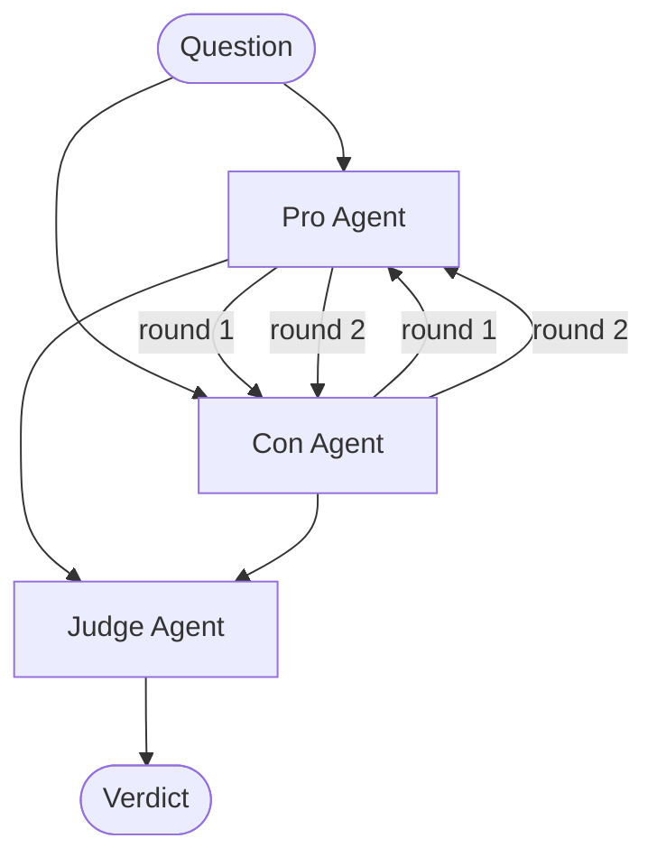

### When to use

- Decisions are genuinely contested (which architecture, which vendor, which strategy).
- You want adversarial pressure to surface weak arguments.
- A single agent reasoning alone tends to converge too quickly on a plausible-but-wrong answer.

### When to avoid

- The "right" answer is knowable from data — don't debate when you can measure.
- Latency matters — debate is slow.
- Cost matters — debate is expensive (3 agents × N rounds).

### Code shape

```python
def debate(question, pro_agent, con_agent, judge, rounds=2):
    transcript = [f"Question: {question}"]
    for r in range(rounds):
        pro = pro_agent.argue(transcript, position="pro")
        transcript.append(f"Pro round {r+1}: {pro}")
        con = con_agent.argue(transcript, position="con")
        transcript.append(f"Con round {r+1}: {con}")
    verdict = judge.decide(question, transcript)
    return verdict
```

### Failure modes

- **Both sides agree.** Mitigation: assign positions, not opinions. "Defend this side" is a job, not a belief.
- **Judge sycophancy.** Judge always favors the last speaker. Mitigation: structured judge rubric, randomize order.
- **Cost explosion.** Mitigation: hard round limit; debate is rarely worth more than 2 rounds.

### Real example

Architectural decision records (ADRs). Two agents argue the merits of, say, REST vs gRPC for a new internal service. The judge produces a recommendation with the trade-offs surfaced. Outcome: not necessarily the "right" choice, but the decision document is much more defensible.

---

## 7. Hub-and-Spoke (Coordinator with Specialists)

A central coordinator dispatches sequentially or in parallel to a fixed set of specialists, then synthesizes.

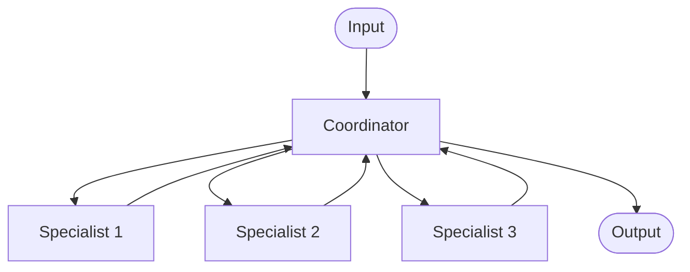

The difference from conditional routing: the coordinator typically uses *multiple* specialists per request, not one of them. The difference from fan-out: the coordinator picks which specialists to invoke based on the request.

### When to use

- You have a portfolio of specialists and the right subset depends on the request.
- The coordinator's planning is non-trivial (which two of five specialists are needed here).
- You need a single place to enforce policy, cost, and audit.

### When to avoid

- The decision of "which specialists" is always the same — just use sequential or parallel.
- The coordinator becomes a bottleneck — consider direct specialist-to-specialist handoff for hot paths.

### Code shape

```python
def hub_and_spoke(request, coordinator, specialists: dict[str, Agent]):
    plan = coordinator.plan(request)               # decides which specialists to invoke
    results = {}
    for spec_name in plan.invoke:
        results[spec_name] = specialists[spec_name].run(request, context=plan.context)
    return coordinator.synthesize(request, results)
```

### Failure modes

- **Coordinator over-summarization.** Coordinator compresses specialist output; downstream loses fidelity. Mitigation: pass artifacts by reference.
- **Specialist over-invocation.** Coordinator invokes every specialist "just in case." Cost balloons. Mitigation: per-request budget; coordinator must justify each invocation.
- **Plan-execute drift.** Specialist returns something the plan didn't anticipate. Mitigation: coordinator can re-plan after each specialist returns.

### Real example

Multi-disciplinary medical triage. Coordinator reads the patient summary and decides whether to invoke cardiology, neurology, radiology, or some combination. Synthesizes findings into a unified recommendation.

---

## 8. Map-Reduce

A specialization of fan-out where the workers are identical and the aggregator is a fold.

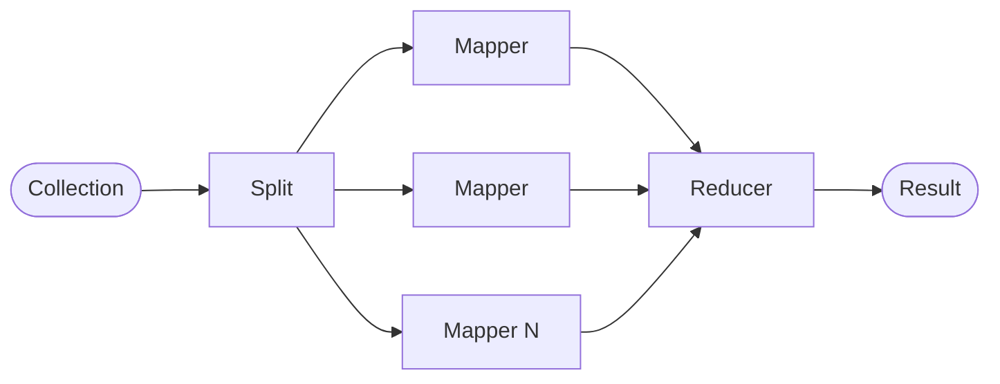

### When to use

- Per-item processing (classify each document, score each candidate, extract from each page).
- The reduction is associative (count, sum, top-k, merge).
- Volume is high enough that single-pass would be too slow.

### When to avoid

- Items have dependencies on each other.
- The reduction is order-sensitive in a way that breaks under parallel processing.

### Code shape

```python
async def map_reduce(items, mapper: Agent, reducer):
    sem = asyncio.Semaphore(MAX_CONCURRENCY)
    async def bounded_map(item):
        async with sem:
            return await mapper.run(item)
    mapped = await asyncio.gather(*[bounded_map(i) for i in items])
    return reducer.reduce(mapped)
```

Things to get right:
- **Idempotency keys per item.** Retries shouldn't duplicate work.
- **Checkpoint partial progress.** Map-reduce jobs that take an hour shouldn't restart from scratch on a worker crash.
- **Bounded concurrency.** The semaphore in the example isn't optional.

### Real example

Email triage over a 10k-message inbox. Mapper classifies each message (action / FYI / spam). Reducer counts categories, then surfaces top-priority items. Wall-clock goes from "all day" to "a few minutes" with appropriate parallelism.

---

## 9. Plan-and-Execute

The orchestrator plans the entire task graph up front, then executes it. Distinct from hub-and-spoke because the plan is explicit and inspectable before any execution.

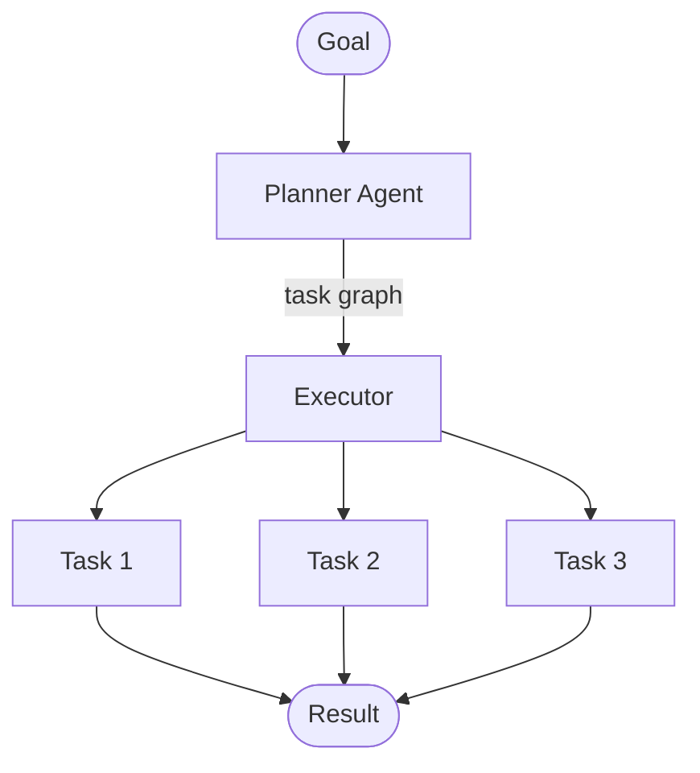

### When to use

- Goals are complex enough to benefit from explicit decomposition.
- You want the plan reviewable (by a human or a verifier agent) before paying for execution.
- Tasks can be statically scheduled.

### When to avoid

- The plan needs to adapt mid-execution based on intermediate results — use ReAct-style step-by-step instead.
- Tasks are highly dynamic — planning is wasted effort.

### Code shape

```python
def plan_and_execute(goal, planner, executor):
    plan = planner.plan(goal)                     # produces a DAG of typed tasks
    if not plan.is_valid():
        raise PlanRejected(plan.errors)
    return executor.execute(plan)
```

The plan is the contract. A good planner output looks like:

```json
{
  "goal": "Migrate the user service from REST to gRPC",
  "tasks": [
    {"id": "t1", "type": "analyze_endpoints", "depends_on": []},
    {"id": "t2", "type": "generate_proto", "depends_on": ["t1"]},
    {"id": "t3", "type": "implement_server", "depends_on": ["t2"]},
    {"id": "t4", "type": "implement_client", "depends_on": ["t2"]},
    {"id": "t5", "type": "migrate_callers", "depends_on": ["t4"]},
    {"id": "t6", "type": "deploy", "depends_on": ["t3", "t5"]}
  ]
}
```

### Failure modes

- **Stale plan.** Plan assumed something that turned out false. Mitigation: re-plan when key assumptions fail.
- **Over-decomposition.** Planner produces 47 tasks when 5 would do. Mitigation: cap task count; force planner to justify each task.
- **Hallucinated dependencies.** Planner invents a dependency that doesn't exist. Mitigation: validate against a typed task schema.

### Real example

Multi-file code refactoring. Plan: list files touched, plan edits per file, execute in dependency order, run tests. The plan is reviewed (optionally by a human) before execution, which catches bad ideas before they cost real tokens.

---

## 10. ReAct (Reason + Act, Step by Step)

A single agent loop that interleaves reasoning and tool calls, deciding the next step after each observation.

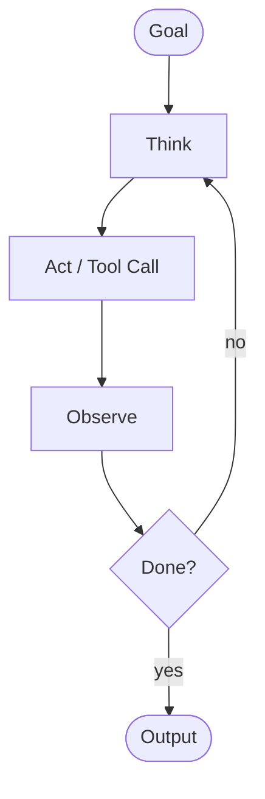

### When to use

- The next step genuinely depends on prior observations.
- The task is exploratory (search, debug, investigate).
- A static plan would be wrong half the time.

### When to avoid

- The task is well-structured — plan-and-execute is cheaper.
- Latency matters — ReAct is sequential by nature.
- Step count is unbounded — without a budget, ReAct loops can run for thousands of steps.

### Code shape

```python
def react(goal, agent, max_steps=20):
    history = [f"Goal: {goal}"]
    for _ in range(max_steps):
        step = agent.next_step(history)            # returns either {tool, args} or {final_answer}
        if step.is_final:
            return step.answer
        observation = run_tool(step.tool, step.args)
        history.append(f"Action: {step.tool}({step.args})\nObservation: {observation}")
    return agent.best_guess(history)               # ran out of budget
```

### Failure modes

- **Wandering.** Agent explores forever without converging. Mitigation: step budget, periodic "are we making progress?" check.
- **Tool oscillation.** Agent calls the same tool with slight variations indefinitely. Mitigation: detect repetition; switch strategy or escalate.
- **Context bloat.** History grows linearly; later steps see a wall of prior observations. Mitigation: periodic summarization of older history.

### Real example

Debugging a failing test. The agent reads the error, calls `grep` for the function name, reads the file, decides the bug is in a helper, reads the helper, proposes a fix. Each step is decided after seeing the previous result; a static plan would not have known to read the helper.

---

## 11. Reflection / Self-Critique

A single agent generates a candidate, then prompted to critique its own output, then revises. A degenerate case of iterative refinement with one agent playing both roles.

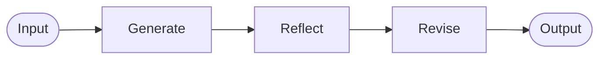

### When to use

- You can't afford a separate critic agent.
- The task benefits from a "step back and check" pass.
- The agent is strong enough that self-critique adds value (smaller models often can't critique themselves usefully).

### When to avoid

- The agent's self-critique is just rephrasing the original output.
- A real critic agent is feasible — it'll be more honest.

### Failure modes

- **Sycophantic reflection.** Agent says "looks great" to its own output. Mitigation: structured rubric ("list 3 specific weaknesses"); force the agent to find issues even when it doesn't want to.
- **Marginal improvement at full cost.** Reflection doubles cost for small quality gains. Measure before committing.

---

## 12. Speculative / Hedged Execution

Run multiple strategies in parallel; take the first acceptable result.

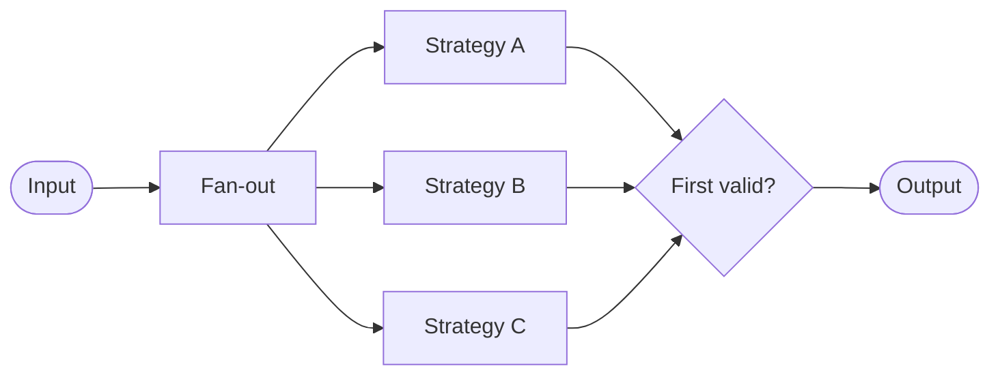

### When to use

- You don't know which strategy will work best.
- Wall-clock latency matters more than total cost.
- Validation of "acceptable" is fast and reliable.

### When to avoid

- Cost is paramount — you're paying 3x for one answer.
- All strategies usually succeed — you're wasting most of the work.

### Real example

Code generation with three different prompting strategies (chain-of-thought, few-shot, plain). Whichever produces compiling code first wins. Useful when the model is small and unreliable; less useful with strong models that mostly succeed on the first try.

---

## 13. Pattern Combinations

Real systems chain patterns. Some common compositions:

### 13.1 Router → Map-Reduce → Refinement

Route incoming items to the right processing pipeline. Map-reduce over the items. Aggregator output goes through iterative refinement before publishing.

### 13.2 Plan-Execute with ReAct Sub-Tasks

The high-level plan is static. Individual tasks are executed via ReAct because their internal structure is dynamic.

### 13.3 Hierarchical with Debate at the Top

The orchestrator runs a debate among architects to choose an approach, then dispatches the chosen approach to specialist workers.

### 13.4 Fan-Out → Critique → Reduce

Multiple writers produce drafts in parallel. A critic ranks them. The top draft is published; the bottom ones are discarded.

The combinations are not arbitrary. Each addition is justified by a specific problem the simpler version couldn't solve.

---

## 14. Anti-Patterns

Patterns that look reasonable and aren't.

### 14.1 The Recursive Orchestrator

An orchestrator that spawns orchestrators that spawn orchestrators. Tracing this in production is impossible. Cap hierarchy depth at 2 unless you have a very specific reason.

### 14.2 The Hidden Loop

An iterative pattern with no explicit max-rounds. "It usually converges in 2–3 rounds" is not a termination condition.

### 14.3 The Synthesized Hallucination

An aggregator that's asked to "summarize" structured worker outputs in natural language. The summary invents content not in the workers' outputs. Use structured outputs and joins, not prose summarization.

### 14.4 The Misnamed Pipeline

A "parallel" pipeline that actually executes serially because each worker awaits the previous one. Verify with a profiler.

### 14.5 The Polite Critic

A critic that always finds something nice to say and never blocks. Useless. The critic's job is to find problems. If it can't, the iteration step adds cost with no benefit.

### 14.6 The Speculative Whole-System

Running three full copies of an entire multi-agent pipeline in parallel and picking the best. Sometimes justifiable. Usually a sign you should be improving the deterministic pipeline instead.

---

## 15. Choosing a Pattern: A Practical Sequence

When designing a new system, walk this sequence:

1. **Can a single LLM call with structured output do it?** If yes, do that.
2. **Can a single ReAct agent do it?** If yes, do that.
3. **Are the sub-tasks linear and dependent?** Sequential pipeline.
4. **Are the sub-tasks independent and parallel-safe?** Fan-out / fan-in (or map-reduce if homogeneous).
5. **Do inputs need different handling?** Conditional routing.
6. **Does quality matter more than latency?** Add iterative refinement on the critical stage.
7. **Is the decomposition complex and reviewable?** Plan-and-execute.
8. **Is the right answer contested?** Debate (rarely justified).

Most production systems land at step 3, 4, or 5 with a sprinkle of step 6. Step 7 appears in code-generation and research workflows. Step 8 is mostly research material.

---

## 16. Operational Concerns Per Pattern

A summary of what you need to monitor for each pattern.

| Pattern | Watch For | Key Metric |
|---------|-----------|------------|
| Sequential | Stage latency drift | p99 per stage |
| Fan-out / fan-in | Straggler tail, rate-limit 429s | p99, error rate per worker |
| Conditional routing | Route distribution skew, low-confidence rate | Routing accuracy, fallback rate |
| Iterative refinement | Round count, ceiling hits | Avg rounds to converge |
| Debate | Round count, judge consistency | Cost per decision |
| Hub-and-spoke | Coordinator latency, specialist utilization | Specialists per request |
| Map-reduce | Throughput, idempotency | Items per second |
| Plan-and-execute | Plan validity, replanning rate | % plans rejected |
| ReAct | Step count, oscillation | Avg steps to completion |

---

## 17. From Pattern to Implementation

A pattern doesn't tell you which framework to use, what to log, or how to test. It tells you the shape of the system. The shape determines:

- **Module boundaries.** Each pattern element is a candidate module.
- **State checkpoints.** Each handoff is a state boundary.
- **Failure cases for testing.** Each pattern's failure modes (Section above) are required test scenarios.
- **Observability instrumentation.** Trace span boundaries follow pattern boundaries.

When you write the design doc, name the patterns explicitly. "We use plan-and-execute at the top with map-reduce inside each plan step." That sentence communicates more than a page of prose.

---

## 18. Further Reading

- [Architecture](architecture.md) — the topology decisions that frame these patterns.
- [Communication](communication.md) — how agents talk to each other within these patterns.
- [State Management](state-management.md) — how to persist intermediate state across pattern boundaries.
- [Examples](examples.md) — end-to-end systems combining several patterns.

### External

- Anthropic, *Building Effective Agents* — the canonical write-up of router, parallelization, orchestrator-worker, and evaluator-optimizer patterns.
- LangGraph cookbook — executable examples of every pattern in this document.
- *ReAct: Synergizing Reasoning and Acting in Language Models* (Yao et al.) — the original ReAct paper.

---

## 19. Pattern Selection Checklist

Before locking the design:

- [ ] Pattern name(s) written in the design doc.
- [ ] Each pattern justified by a concrete problem it solves.
- [ ] Failure modes from this guide added to the test plan.
- [ ] Observability metric for the pattern wired up.
- [ ] Termination condition(s) defined for any iterative or recursive pattern.
- [ ] Cost budget per request defined.
- [ ] Plan reviewed by someone other than the original designer.

---

**Status:** Living catalog. Add new patterns only after you've shipped them in two systems.
