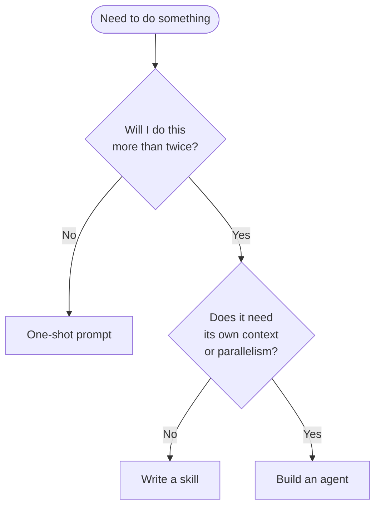
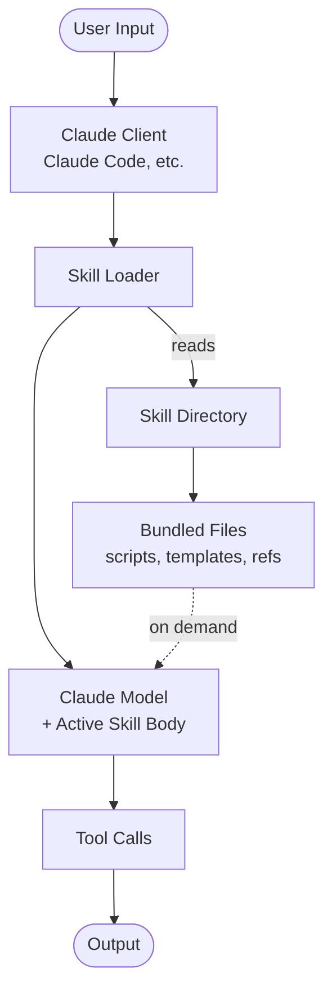

# Claude Skills: A Working Guide

What Claude Skills are, when they earn their place in a workflow, and where they sit in the spectrum between "ad-hoc prompt" and "full sub-agent."

This guide is pragmatic. It assumes you've used Claude Code (or another Claude Skills-compatible client) for at least a few real tasks and have hit the moments where you wished a repeatable workflow could be invoked by name.

---

## 1. What a Claude Skill Actually Is

A **skill** is a named, reusable instruction set that Claude loads on demand. Concretely:

- A folder with a `SKILL.md` file (YAML frontmatter + Markdown body).
- The folder may contain supporting files: scripts, templates, reference docs, example inputs.
- The skill has a **name**, a **description**, and a **body** of instructions.
- Optionally, it declares allowed tools and other metadata.

When the skill is loaded — by the user typing `/skill-name`, or by Claude auto-loading it based on the description — its instructions become part of the active context. Claude then executes the workflow described by the skill, with access to its bundled assets.

That's it. It's not magic. It's a structured way to package "the right prompt + the right reference material + the right helper scripts" so a useful workflow becomes a one-token invocation.

---

## 2. The Skill-as-Slash-Command Model

Mentally, treat a skill as a slash command in a chat-style tool. Users type `/migrate-rails-7-to-8` and Claude loads the migration playbook, opens the right files, and starts the work.

This model has implications:

- **Skills are discoverable.** Each skill shows up as its own slash command — users find them via `/help` or the client's slash-command autocomplete.
- **Skills are invocable.** Either explicitly (`/skill-name`) or by Claude itself when the active task matches the skill's description.
- **Skills compose with the active conversation.** A loaded skill doesn't replace what's happening; it adds to it.
- **Skills are version-controlled.** The folder lives in a repo. Changes go through review.

This is the same shape as Unix executables on PATH: a name resolves to a known, repeatable thing. The skill folder is the implementation.

---

## 3. Auto-Loading vs User-Invocation

A skill can be invoked in two ways. The distinction matters when you're writing one.

### 3.1 User invocation

The user types `/skill-name`. Claude loads the skill body verbatim. Whatever is in the description doesn't matter for routing — the user named it directly.

Use this when:
- The user knows the skill exists.
- The skill is rarely-needed but valuable when needed.
- You want explicit human intent before executing.

### 3.2 Auto-loading

Claude reads available skill descriptions and decides whether to load one based on the user's current request. The **description** is the entire mechanism. A skill with a vague description never gets auto-loaded; a skill with a sharp description matches the right requests.

Use this when:
- The skill applies broadly and frequently.
- The user shouldn't have to remember the skill exists.
- Loading the skill is cheap and the harm of false positives is low.

### 3.3 The Description Is the Bug

Most "my skill doesn't work" reports trace back to the description. The description must:

- Mention **what the skill does** in plain terms.
- Mention **when to use it** with concrete triggers (file types, user phrases, code patterns).
- Optionally mention **when not to use it** to suppress false positives.

A bad description:

> "Helps with migrations."

A good description:

> "Use this skill when migrating a Rails application from version 7 to version 8. Triggers: user mentions `rails 8`, `bin/rails app:update`, or modifies `Gemfile` with a Rails 8 version constraint. Skip for greenfield Rails 8 projects."

The description is the routing logic. Treat it like code.

---

## 4. Skill Scope

Skills live at one of three scopes. The scope determines who sees them and where they're stored.

| Scope | Location | Visible to | Use for |
|-------|----------|------------|---------|
| Project | `.claude/skills/` in repo | Anyone working in that repo | Project-specific workflows, conventions, codebase tours |
| User | `~/.claude/skills/` | The individual user across all projects | Personal productivity skills, preferred patterns |
| Plugin | Inside an installed plugin package | Anyone with the plugin installed | Shared / public / commercial skills |

A skill of the same name at a more-specific scope wins. Project skills override user skills override plugin skills. This lets a team standardize on a project-level version of a skill while individuals keep their personal variants.

### 4.1 Picking a scope

- **Will this skill make sense outside this codebase?** No → project.
- **Does it encode my personal style?** Yes → user.
- **Should other people install this with one command?** Yes → plugin.

Most skills should start as project or user scope. Plugins are for distribution, not for first drafts.

---

## 5. Metadata and Allowed Tools

The `SKILL.md` frontmatter declares what the skill is and what it's allowed to do.

Minimum viable frontmatter:

```yaml
---
name: migrate-rails-7-to-8
description: |
  Use this skill when migrating a Rails application from version 7 to version 8.
  Triggers: user mentions `rails 8`, `bin/rails app:update`, or modifies `Gemfile`
  with a Rails 8 version constraint. Skip for greenfield Rails 8 projects.
---
```

Common optional fields:

```yaml
---
name: migrate-rails-7-to-8
version: 1.2.0
description: |
  ...
allowed-tools:
  - Read
  - Edit
  - Bash
  - Grep
metadata:
  category: migration
  tags: [rails, ruby, upgrade]
  author: platform-team
---
```

### 5.1 `allowed-tools`

The most important non-description field. Restricts which tools Claude can use while the skill is active.

**It must be a top-level frontmatter field.** If you nest it under `metadata:`, the client treats it as inert metadata and the restriction is *not enforced* — a security-relevant footgun.

- **Set it narrow.** If the skill is "format this file," it doesn't need `WebFetch`. Don't grant it.
- **Set it explicit.** Listing allowed tools is faster than enumerating disallowed ones.
- **Set it auditable.** When reviewing a skill, `allowed-tools` is the first thing to scrutinize.

For destructive skills (anything that runs `Bash` or `Write`), being narrow about tools is a real defense-in-depth measure.

### 5.2 Other useful fields

- `version` — semver. Bump when behavior changes.
- `requires` — other skills this skill depends on or composes with.
- `inputs` — declared arguments (for clients that support typed inputs).
- `tags` — for discoverability in skill listings and catalogs.

The schema varies slightly between Claude Code, plugin distributions, and other Skills-compatible clients. Read your target client's spec.

---

## 6. Skill Discovery

Users find skills three ways:

### 6.1 `/help` and slash-command listings

Most clients list available skills alongside other slash commands (there is no separate `/skill` command — each skill *is* a slash command). The listing shows the name and description. This is why descriptions matter for users, not just for auto-loading.

### 6.2 Autocomplete

When a user types `/migr...`, autocomplete surfaces `/migrate-rails-7-to-8`. Names should be predictable: lowercase, hyphenated, verb-noun.

### 6.3 Auto-loading

The model itself selects skills based on the conversation. Already covered above; this is description-driven.

A skill that no one can find is not a skill. Naming and description writing are the user-experience surface of the skill.

---

## 7. When to Write a Skill vs Something Else

The three options:

- **One-shot prompt.** "Hey Claude, please do X right now."
- **Skill.** "I'll need this exact workflow again. Make it `/x`."
- **Agent / sub-agent.** "I want this to run as its own first-class entity, possibly in parallel, with its own context window and tools."

### 7.1 Use a one-shot prompt when

- The task is genuinely novel.
- You'll never need it again.
- Encoding it as a skill would take more time than just doing it.

### 7.2 Use a skill when

- The workflow recurs.
- The right prompt is non-trivial (took experimentation to get it right).
- You want others (or your future self) to invoke it by name.
- The workflow benefits from bundled assets (templates, scripts, reference docs).
- The output should be consistent across invocations.

### 7.3 Use an agent / sub-agent when

- The work is a substantial chunk that deserves its own context.
- You want it to run in parallel with other work.
- It needs its own system prompt that would conflict with the parent's.
- It needs a different model size (e.g., cheap worker for bulk work).
- It will compose with other agents in an orchestrated system.

### 7.4 Decision tree



### 7.5 Skills and agents are not mutually exclusive

A common pattern: a skill that invokes a sub-agent. The skill defines the workflow shape; the sub-agent does the heavy lifting in its own context. Example: a `/audit-security` skill that dispatches three parallel sub-agents (dependency scan, auth review, secret hunt) and aggregates their results.

The shorthand: **skills are recipes; agents are workers.** A recipe can call workers.

---

## 8. Anatomy of a Useful Skill

What separates a skill that gets used from one that rots:

### 8.1 Clear name

Verb-noun, lowercase, hyphenated. `migrate-rails-7-to-8`, `audit-dependencies`, `generate-typeguards`. Not `helper`, not `utils`, not `my-thing`.

### 8.2 Sharp description

Already covered. Tells the model when to load. Tells the user what they're invoking.

### 8.3 Step-by-step body

The body should read as a procedure, not as background reading. The user is going to invoke this and the model is going to execute it.

Bad body:

> This skill is about migrating Rails apps. Rails 8 introduced several breaking changes around session storage and the asset pipeline...

Good body:

> ## Procedure
>
> 1. Read `Gemfile` and confirm Rails version constraint.
> 2. Run `bundle outdated rails` to see current vs target.
> 3. Run `bin/rails app:update` and review each conflict.
> 4. Apply the standard configuration migrations from `config/initializers/` (see `references/initializers.md`).
> 5. Run the test suite. Fix any breakage using the patterns in `references/common-breakage.md`.
> 6. Commit each logical change separately with a Conventional Commit message.

The good body is executable. The model knows what to do step by step.

### 8.4 Bundled assets

Anything the skill needs that isn't worth re-explaining in the body. Common assets:

- `references/` — Markdown reference docs the model can read on demand.
- `templates/` — File templates the skill copies and customizes.
- `scripts/` — Helper scripts the model can run.
- `examples/` — Worked examples for the model to mimic.

### 8.5 Anti-pattern callouts

The body should include "do not do this" lists. The model is biased toward action; sometimes the right action is "don't reach for X."

### 8.6 Verification step

Skills that ship with a "how do I know it worked?" step are dramatically more useful than ones that don't. Examples: "run the test suite," "open the file and confirm the schema," "post a sample request to the endpoint."

---

## 9. Where Skills Live in the Toolchain

A mental model of the layered system.



The skill is just the body and metadata loaded into the model's working context, with file paths that the model can read or execute via its normal tool surface.

This is why skills don't need to be complicated. They're not a separate runtime. They're a structured way to inject context.

---

## 10. Patterns for Effective Skills

### 10.1 The Recipe Skill

A linear procedure. "Do this, then this, then this." Most common type. Great for migrations, audits, refactors, deployments.

### 10.2 The Reference Skill

A skill whose primary purpose is to load reference material into context. The body is short ("you're about to work on X; here's what you need to know") and the bulk of value is in `references/`.

Example: a `/postgres-best-practices` skill whose body just says "consult `references/indexes.md`, `references/transactions.md`, and `references/migrations.md` as needed for the upcoming Postgres work."

### 10.3 The Pipeline Skill

A skill that orchestrates multiple sub-steps, possibly via sub-agents. Body is the orchestration; sub-agents do the work.

Example: a `/release` skill that runs (a) version bump, (b) changelog generation, (c) tag creation, (d) artifact build, (e) publish — each as a sub-agent in sequence.

### 10.4 The Wrap-a-Tool Skill

A skill that turns a command-line tool into a Claude-aware workflow. The body knows how to invoke the tool, parse its output, and respond meaningfully to errors.

Example: a `/run-mypy` skill that runs `mypy`, parses the errors, opens the affected files, and proposes typed fixes for each.

### 10.5 The Onboarding Skill

A skill whose purpose is to teach Claude about a specific codebase, project, or domain. Bundles the architecture overview, key file locations, common gotchas, and house style. Invoked once at the start of work on that codebase.

---

## 11. Skill Anti-Patterns

Patterns that look like good ideas and aren't.

### 11.1 The Kitchen Sink Skill

A skill that "does everything related to X." Body is 3000 lines. Description is vague. Never gets auto-loaded because the model can't tell when it applies. Fix: split into N narrower skills.

### 11.2 The Whispered Skill

A skill with a one-line description. Never gets auto-loaded; users forget it exists. Fix: rewrite the description with explicit triggers.

### 11.3 The Documentation Skill

A skill whose body is documentation, not procedure. Reads like a wiki page. Doesn't tell Claude what to *do*. Fix: convert to numbered steps with concrete actions.

### 11.4 The Lying Description

Description says the skill does X. Body actually does Y. Worse: description claims the skill handles edge cases that the body doesn't. Fix: write the body first, then write the description from the body.

### 11.5 The Skill Without Verification

Skill produces output. User has no way to know if it's correct. Fix: include verification steps. "After completion, run X to confirm."

### 11.6 The Bash-Happy Skill

Skill freely runs destructive Bash commands without `allowed-tools` restriction. One subtle prompt-injection later, you've lost data. Fix: restrict `allowed-tools` and never grant `Bash` unless absolutely required, and even then, scope what the body invokes.

### 11.7 The Stale Skill

Skill was written 18 months ago. Codebase has changed. Skill's instructions point at files that don't exist. Fix: version skills; review on a schedule; delete when no longer accurate.

---

## 12. Distribution and Governance

### 12.1 Project skills as part of the repo

Project skills live in `.claude/skills/`. They're part of the repo. They're reviewed in PRs. They evolve with the codebase. This is the default for team skills.

### 12.2 User skills as personal toolkit

User skills live in `~/.claude/skills/`. They're personal. They can codify "how I like to work." They're not subject to team review.

### 12.3 Plugin distribution

For skills that should be shared beyond a single codebase or person:

- Package the skill folder inside a plugin.
- Distribute via your plugin registry (Anthropic's, or an internal one).
- Users install with one command and the skill becomes available globally.

Plugin skills are the right answer for:
- Open-source tools that ship with a Claude integration.
- Internal platform teams shipping reusable workflows.
- Vendors offering Claude-aware products.

### 12.4 Versioning

Plugin skills should be versioned. Project skills can use git history. Either way:

- Bump on behavior changes.
- Document breaking changes.
- Provide migration notes if user-visible behavior shifts.

---

## 13. Skills, Agents, MCP: How They Fit Together

A quick taxonomy because the terms get conflated.

| Concept | What it is | When to use |
|---------|-----------|-------------|
| Skill | Named, loadable prompt + assets | Repeatable workflows you want to invoke by name |
| Sub-agent | A Task delegated to a fresh Claude context | Work that needs its own context window or runs in parallel |
| MCP server | An external process exposing tools to Claude | Adding tool capabilities (database access, custom APIs) |
| Plugin | A distribution package | Sharing skills (and optionally agents, hooks, MCP server configs) |

They compose:

- A skill can dispatch sub-agents.
- A skill can require certain MCP servers be available.
- A plugin can bundle skills, sub-agent definitions, hooks, and MCP server configuration.

Don't try to force a workflow into one of these. Pick the right one for the right layer.

---

## 14. Maturity Stages of a Skill

How a skill evolves over time, ideally.

| Stage | Signals | Next step |
|-------|---------|-----------|
| Draft | Body is a brain dump; no metadata | Add description; structure as steps |
| Functional | Works for the author | Test with a colleague |
| Reliable | Works for others; rarely surprising | Add verification step; add anti-patterns |
| Mature | Versioned; documented; reviewed | Consider promoting to plugin scope |
| Deprecated | Codebase or tool changed; no longer accurate | Delete or rewrite |

The skill that stalls at Draft is the most common kind. The investment to reach Functional is small but real — block out an hour to actually write the steps and try them.

---

## 15. Cost and Performance Considerations

Skills are cheap to load (just inject text into the context). The cost shows up in:

- **Context window usage.** A 5000-token skill body burns tokens on every turn while loaded. Keep skills tight; reference external files rather than embedding them.
- **Tool calls.** If the skill instructs the model to read 20 files upfront, that's 20 tool calls before any real work. Use targeted reads.
- **Sub-agent dispatches.** Each sub-agent is a fresh context — paid for. Don't dispatch sub-agents for trivial work.

Bias: keep skill bodies under 500 lines. Push reference material to `references/` files the model reads on demand. The skill body is the procedure; the references are the data.

---

## 16. Skill Review Checklist

Before merging or publishing a skill:

- [ ] Name is verb-noun, lowercase, hyphenated.
- [ ] Description includes what the skill does and when to use it.
- [ ] Description includes when *not* to use it (if relevant).
- [ ] Body is structured as a procedure, not exposition.
- [ ] Steps are concrete and actionable.
- [ ] Bundled assets referenced from body (not embedded inline).
- [ ] `allowed-tools` is set explicitly and narrowly.
- [ ] Anti-patterns / "do not do" guidance included.
- [ ] Verification step at end ("how do I know it worked?").
- [ ] Versioned if distributed via plugin.
- [ ] Tested by someone other than the author.
- [ ] Listed in the team / project's skill catalog.

If you can't honestly tick most of these, the skill isn't ready.

---

## 17. Further Reading

- [Creating Skills](creating.md) — step-by-step skill construction.
- [Skill Catalog](catalog.md) — curated list of useful skills.
- `templates/basic-skill/SKILL.md` — minimal working template.
- `templates/skill-with-script/SKILL.md` — advanced template with bundled scripts.

### External

- Anthropic Claude Code documentation, Skills section.
- Skill examples shipped with the Claude Code distribution — read them; the conventions are visible.
- Plugin registries (Anthropic, community) for inspiration.

---

## 18. FAQ

**Q: Can a skill call another skill?**
A: Conceptually yes — the body can instruct the model to invoke `/other-skill`. In practice, prefer composing skills via shared `references/` files rather than chained invocations, because chained skill loads compound context cost.

**Q: How big can a skill body be?**
A: Technically as big as the context window allows. Practically: keep it under 500 lines. If it's growing past that, you have a kitchen-sink skill and should split it.

**Q: Do skills work across Claude Code, the API, and other clients?**
A: The skill format (folder + SKILL.md + assets) is reasonably portable but the loader and metadata schema vary. Claude Code is the reference implementation. Check your client's docs for the exact frontmatter fields supported.

**Q: Should skills do their work directly or always dispatch to sub-agents?**
A: Direct is fine and often preferable. Dispatch to sub-agents only when you need a fresh context, parallel execution, or a different model.

**Q: Can a skill load conditionally based on the user's input?**
A: Auto-loading is the model's decision based on the description. You don't get programmatic conditional loading — the description is the condition.

**Q: How do I test a skill?**
A: Invoke it explicitly with a representative task. Verify the output. Then disable explicit invocation and verify auto-loading triggers on the right phrases (you'll need to test in a fresh conversation). Repeat for a handful of cases.

**Q: My skill works for me but not for my colleague. Why?**
A: Most common cause: their environment is different (different tools available, different files in expected locations). Second most common: their version of the client uses different metadata field names. Third: the description loads for them on unrelated requests, polluting their context.

---

## 19. From Skill to Plugin

A natural progression for a skill that proves valuable:

1. **Born as user-scoped.** You wrote it for yourself.
2. **Promoted to project-scoped** when your team adopted it. Moved into `.claude/skills/`, reviewed in PRs.
3. **Promoted to plugin** when other teams want it. Packaged, versioned, distributed.

The promotion doesn't happen automatically. At each step, the skill must be reviewed for portability: does it assume facts specific to the previous scope? A user-scoped skill that hardcodes a path under `~/my-stuff/` doesn't survive promotion to project scope without changes.

This progression is the same one good code follows: write it for yourself, refactor for the team, publish for the community.

---

**Status:** Skills are a leverage point. A well-written one saves the team hours per week. A badly written one wastes context tokens and produces unreliable output. Invest accordingly.
